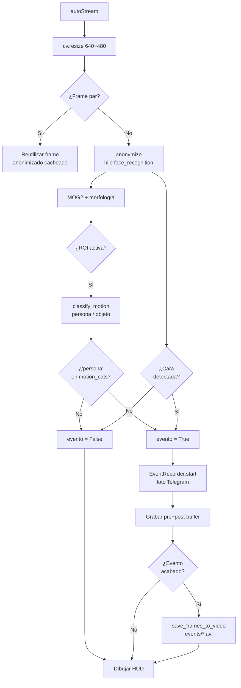

# Detector de Actividad

## Descripción

`actividad/actividad.py` detecta actividad en una ROI manual y dispara un evento cuando clasifica un contorno como **persona** (por forma del contorno MOG2) **o** cuando `face_recognition` reconoce una cara, lo que ocurra primero. Además **anonimiza** las caras detectadas y envía notificaciones con foto y clip de vídeo vía **bot de Telegram**.

---

## Requisitos y ejecución { #requisitos }

!!! info "Entorno"
    Python 3.10+, OpenCV 4.9, NumPy 1.26, `face_recognition`, `python-telegram-bot`.

!!! warning "Credenciales necesarias"
    Antes de ejecutar, crea el fichero `token.env` dentro de la carpeta `actividad/` con el token de tu bot de Telegram:
    ```
    TOKEN=<tu_token>
    USER_ID=<tu_chat_id>
    ```
    Si el fichero no existe, el programa lanza una excepción al arrancar (fallo rápido e intencionado).

```bash
python actividad/actividad.py
```

!!! tip "Configuración de la ROI"
    Al arrancar, haz **dos clics** sobre la imagen para definir la región de interés rectangular. Solo se procesará el movimiento dentro de esa región.

---

## Arquitectura { #arquitectura }



<figure markdown>
  
  <figcaption>Definición de la ROI rectangular mediante dos clics.</figcaption>
</figure>

---

## Parámetros clave { #parametros }

### Clasificación de movimiento

| Criterio | Umbral | Justificación |
|----------|--------|---------------|
| `ratio = h/w` | > 1.35 | Las personas son más altas que anchas |
| `h` | > 60 px | Descarta detecciones diminutas |
| `fill = área/(w×h)` | < 0.80 | Las personas son menos compactas que cajas |

!!! tip "Parámetro más sensible: ratio h/w"
    Una persona agachada o sentada puede tener `ratio < 1.35` y clasificarse como objeto. Para vigilancia estática donde las personas pasan de pie, los umbrales actuales funcionan razonablemente bien.

### Anonimización de caras

| Parámetro | Valor | Descripción |
|-----------|-------|-------------|
| `FACE_UPDATE_INTERVAL` | 8 frames | Frecuencia de actualización de la detección |
| `FACE_SCALE` | 0.25 | Resolución de inferencia (1/4 del frame original) |
| Margen del bloque | 35% | Ampliación del bbox antes de censurar |

!!! tip "HOG vs CNN para detección de caras"
    HOG es más rápido (~80 ms) pero falla con caras de perfil o parcialmente tapadas. CNN detecta mejor en condiciones difíciles pero triplica el tiempo de llamada (~300 ms). En exteriores o con cámaras en ángulo, considera cambiar a `model="cnn"`.

### Grabación de eventos

| Parámetro | Valor | Descripción |
|-----------|-------|-------------|
| `pre_sec` | 2 s | Duración del pre-buffer antes del evento |
| Post-buffer | 1 s tras último movimiento | Tiempo de cola al cerrar el evento |

---

## Código clave { #codigo }

### Detección y clasificación

<figure markdown>
  
  <figcaption>Persona detectada dentro de la ROI (bbox rojo).</figcaption>
</figure>
<figure markdown>
  
  <figcaption>Objeto detectado dentro de la ROI (bbox azul).</figcaption>
</figure>

```python title="actividad/actividad.py — classify_motion()" linenums="1"
def classify_motion(frame, mask_roi, min_area=MIN_AREA_MOV):
    results = []
    for cnt in cv.findContours(mask_roi, cv.RETR_EXTERNAL,
                                cv.CHAIN_APPROX_SIMPLE)[0]:
        area = cv.contourArea(cnt)
        if area < min_area:
            continue
        x, y, w, h = cv.boundingRect(cnt)
        ratio = h / max(w, 1)          # relación de aspecto
        fill  = area / max(w * h, 1)   # compacidad
        cat = "persona" if ratio > 1.35 and h > 60 and fill < 0.8 else "objeto"
        results.append((cat, x, y, w, h))
    return results
```

La detección de personas combina la clasificación por contorno con el reconocimiento facial. Si cualquiera de las dos condiciones se cumple, se dispara el evento:

```python title="actividad/actividad.py — condición de evento" linenums="1"
face_detected = bool(face_state["last_faces"])
evento = detection_mode in motion_cats or (detection_mode == "persona" and face_detected)
```

Esto cubre casos que MOG2 no detecta: una persona que entra despacio en el encuadre (sin movimiento brusco suficiente para superar el umbral de área) o una cara visible aunque la silueta no cumpla el ratio h/w > 1.35.

### Anonimización de caras

<figure markdown>
  
  <figcaption>Cara censurada con bloque negro con margen del 35%. La detección se ejecuta en hilo separado cada 8 frames.</figcaption>
</figure>

```python title="actividad/actividad.py — anonymize()" linenums="1"
FACE_UPDATE_INTERVAL = 8
FACE_SCALE = 0.25   # trabaja a 1/4 de resolución

def detect_faces(frame, model):
    inv   = 1 / FACE_SCALE
    small = cv.resize(frame, (0, 0), fx=FACE_SCALE, fy=FACE_SCALE)
    locations = face_recognition.face_locations(
        cv.cvtColor(small, cv.COLOR_BGR2RGB), model=model
    )
    return [(int(t*inv), int(r*inv), int(b*inv), int(l*inv))
            for t, r, b, l in locations]

def anonymize(frame, face_state, face_queue):
    if face_state["frame_count"] % FACE_UPDATE_INTERVAL == 0 \
            and not face_queue.full():
        face_queue.put((frame.copy(), face_state["detector"]))
    face_state["frame_count"] += 1
    out = frame.copy()
    h, w = frame.shape[:2]
    with face_state["lock"]:
        faces = list(face_state["last_faces"])
    for t, r, b, l in faces:
        dx, dy = int((r - l) * 0.35), int((b - t) * 0.35)
        out[max(0,t-dy):min(h,b+dy), max(0,l-dx):min(w,r+dx)] = 0
    return out
```

### Grabación y alertas

<figure markdown>
  
  <figcaption>Indicador de grabación activo en el HUD.</figcaption>
</figure>
<figure markdown>
  
  <figcaption>Notificación recibida en Telegram con la captura del evento y la categoría detectada.</figcaption>
</figure>

<figure markdown>
  
  <figcaption>Carpeta <code>events/</code> con los clips guardados automáticamente. El nombre incluye la marca de tiempo.</figcaption>
</figure>

---

## Decisiones de diseno { #decisiones }

### Detección de personas con doble criterio (MOG2 + cara)

Para que el modo "persona" sea robusto, el evento se dispara si **cualquiera** de las dos condiciones es cierta:

1. `classify_motion()` clasifica un contorno MOG2 como "persona" (ratio h/w > 1.35, h > 60 px, fill < 0.80).
2. `face_recognition` detecta al menos una cara en el frame actual.

El criterio de silueta falla con personas agachadas o sentadas; el de cara falla si la persona está de espaldas o fuera de encuadre. Juntos se complementan. El criterio facial aprovecha el hilo de detección que ya existe para la anonimización, sin coste extra.

### Clasificación heurística frente a detector neural

En lugar de HOG+SVM o YOLO, los contornos del foreground se clasifican por tres criterios geométricos (→ ver [`classify_motion()`](#codigo), línea 1). Es una apuesta deliberada por velocidad y simplicidad — un detector neural anadiría cientos de milisegundos en CPU. El precio es conocido: personas agachadas o sentadas se clasifican como objeto; en ese caso el criterio de cara actúa como respaldo.

### Detección de caras en hilo separado con caché de 8 frames

`face_recognition` tarda ~80 ms (HOG) o ~300 ms (CNN), demasiado para cada frame. La solución es un `face_worker` dedicado que reutiliza el último resultado durante 8 frames (→ ver [`anonymize()`](#codigo), línea 14). El stream no se bloquea aunque la máscara vaya ligeramente rezagada cuando una cara entra o sale de plano. La detección trabaja además a 1/4 de resolución (`FACE_SCALE=0.25`) para reducir el tiempo de inferencia. Además, `face_worker` implementa un periodo de gracia de 3 ciclos (`MAX_GRACE=3`): si la detección devuelve cero caras, mantiene las posiciones anteriores durante 3 actualizaciones antes de borrarlas, evitando parpadeos cuando una cara queda momentáneamente fuera del campo de la cámara.

### Pre-buffer con `deque` de tamano dinámico

El clip guardado incluye los segundos previos al evento gracias a un `deque` circular. Su tamano se recalcula cada frame a partir del FPS real (`max(1, int(pre_sec * fps))`), de forma que el pre-buffer siempre representa los mismos segundos reales independientemente de si la cámara va a 15 o 30 fps.

### Frames pares descartados del procesamiento

El bucle principal salta el procesamiento en frames pares, reutilizando el último frame anonimizado. Esto reduce a la mitad las llamadas a `anonymize`, `clean_mask` y `classify_motion` sin que sea perceptible visualmente a 25+ fps.

### Telegram como canal de alertas

La foto se envía desde el hilo principal para garantizar que corresponde exactamente al frame que disparó el evento; el clip se guarda y envía al terminar la grabación. Si `token.env` no existe el programa falla en el arranque — fallo rápido y visible antes de que el sistema quede corriendo sin alertas.

---

## Limitaciones { #limitaciones }

!!! warning "Limitaciones conocidas"
    - Clasificación heurística: personas agachadas o sentadas pueden clasificarse como "objeto".
    - Cualquier vibración de la cámara genera falsos positivos en todo el foreground.
    - Si `token.env` no existe o está mal configurado, el programa lanza excepción al arrancar.

!!! warning "Dificultades de anonimización"
    La anonimización de caras es inherentemente imperfecta en las condiciones actuales:

    - **Resolución de inferencia reducida** (`FACE_SCALE=0.25`): detectar caras a 1/4 del tamano original hace que caras pequenas o lejanas pasen desapercibidas, dejando rostros sin censurar.
    - **Modelo HOG**: no detecta caras de perfil, caras parcialmente tapadas ni caras en condiciones de poca luz. Cambiar a `cnn` mejora la cobertura pero multiplica el tiempo de inferencia (~300 ms).
    - **Retraso de hasta 8 frames**: la detección solo se lanza cada 8 frames. A 25 fps, una cara puede aparecer y desaparecer en pantalla sin haber sido nunca anonimizada si su tránsito dura menos de ~320 ms.
    - **Descarte de frames pares**: el bucle principal salta el procesamiento en frames pares, por lo que en fotogramas de buffer de pre-evento puede quedar almacenado el último frame anonimizado en lugar del frame real en esos instantes.
    - **Grace period parcialmente visible**: durante los 3 ciclos de gracia tras perder una cara, la región censura una posición desactualizada; si la persona se ha movido, la cara real puede quedar al descubierto momentáneamente.