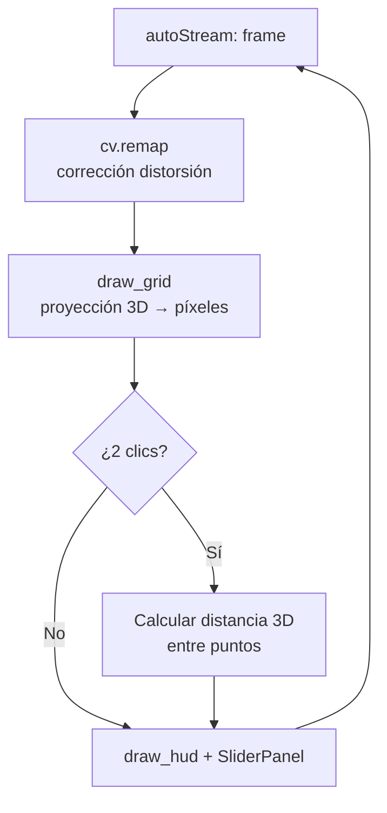
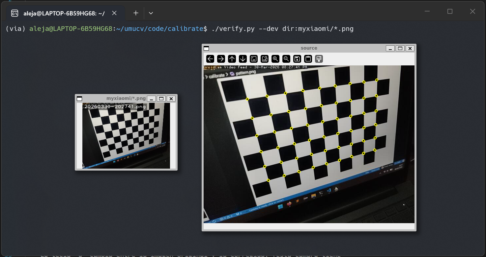
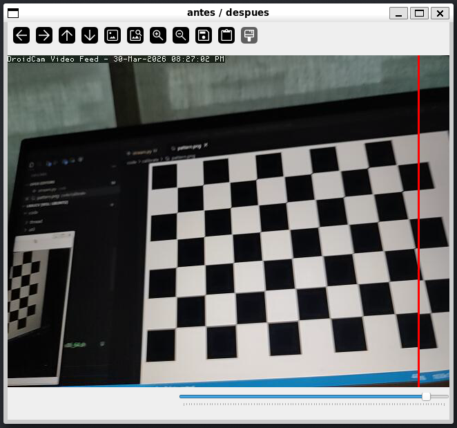
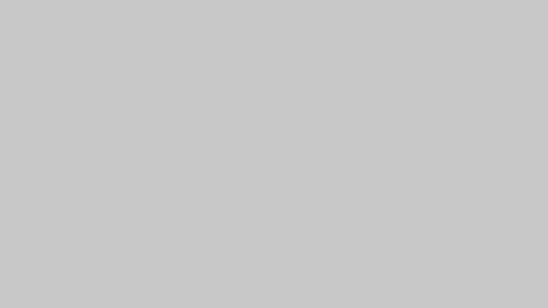

# Calibración de Cámara

## Descripción

El bloque de calibración abarca tres tareas: obtener los **parámetros intrínsecos** de la cámara mediante un tablero de ajedrez, calcular el **campo visual (FOV)** y desarrollar una herramienta interactiva que superponga una **cuadrícula de medida real** sobre la imagen usando proyección 3D.

Los scripts relevantes son `calibracion/grid.py` y el fichero de parámetros `calibracion/calib.txt`.

---

## Requisitos y ejecución { #requisitos }

!!! info "Entorno"
    Python 3.10+, OpenCV 4.9, NumPy 1.26.

```bash
# Lanzar herramienta interactiva de cuadrícula
python calibracion/grid.py
```

!!! tip "Primera ejecución"
    Asegúrate de tener al menos 10 imágenes del tablero desde ángulos distintos antes de calibrar. Con menos imágenes los coeficientes de distorsión son poco fiables.

---

## Arquitectura { #arquitectura }



---

## Parámetros clave { #parametros }

### Matriz intrínseca $K$

$$
K = \begin{pmatrix}
480.1 & 0     & 319.8 \\
0     & 480.1 & 236.7 \\
0     & 0     & 1
\end{pmatrix}
$$

| Parámetro | Valor | Descripción |
|-----------|-------|-------------|
| $f_x$ | 480.15 px | Distancia focal horizontal |
| $f_y$ | 480.06 px | Distancia focal vertical |
| $c_x$ | 319.85 px | Centro óptico X |
| $c_y$ | 236.66 px | Centro óptico Y |
| $k_1$ | 0.0558 | Distorsión radial 1er orden |
| $k_2$ | −0.3856 | Distorsión radial 2º orden |
| $k_3$ | 0.4551 | Distorsión radial 3er orden |

!!! tip "Parámetros sensibles"
    `k2` y `k3` tienen valores altos y signos opuestos — esto es normal en objetivos con distorsión en barril moderada. Un `k2` muy negativo sin `k3` que lo compense generaría una corrección excesiva en los bordes.

### Campo visual (FOV)

La calibración se realizó a **640 × 480 px**.

$$
\text{FOV}_h = 2 \arctan\!\left(\frac{640}{2 \times 480.1}\right) \approx 67.4°
$$

$$
\text{FOV}_v = 2 \arctan\!\left(\frac{480}{2 \times 480.1}\right) \approx 53.1°
$$

### Sliders de la herramienta interactiva

| Slider | Variable | Significado |
|--------|----------|-------------|
| **Z** | `w_z` | Distancia al plano de interés (cm) |
| **A** | `c_h` | Altura de la cámara sobre el suelo (cm) |
| **X** | `cell` | Tamaño de celda de la cuadrícula (cm) |

!!! tip "Parámetro más sensible: A (altura)"
    Un error de pocos centímetros en `c_h` se amplifica con la distancia: las líneas horizontales de la cuadrícula se descuadran progresivamente hacia el fondo. Ajusta `A` hasta que la línea base gruesa coincida visualmente con el suelo real.

---

## Código clave { #codigo }

### Proceso de detección de esquinas

<figure markdown>
  
  <figcaption>Esquinas detectadas con <code>cv2.findChessboardCorners</code> y refinadas con <code>cornerSubPix</code>.</figcaption>
</figure>

<figure markdown>
  
  <figcaption>Comparativa antes / después de aplicar <code>cv2.undistort</code>. Nótese la corrección de la distorsión radial en los bordes.</figcaption>
</figure>

### Proyección de cuadrícula

```python title="calibracion/grid.py — proyección de cuadrícula" linenums="1"
def ray(x, y):
    """Rayo normalizado que pasa por el píxel (x, y)."""
    return np.array([(x - cx)/fx, (y - cy)/fy, 1.0])

def floor_pt(x, y, h):
    r = ray(x, y)
    return None if r[1] <= 1e-6 else r * (h / r[1])

def draw_grid(img, K, w_z, c_h, cell):
    w = img.shape[1]
    lx = -w_z * cx / fx
    rx =  w_z * (w - cx) / fx
    xs = grid(lx, rx, cell)
    for xg in xs:
        line3d(img, [xg, c_h, 0.05], [xg, c_h, w_z], K, UI_THEME["C_TRACK"])
    for z in np.arange(0.05, w_z + cell, cell):
        lx2 = -z * cx / fx
        rx2 =  z * (w - cx) / fx
        pts = line3d(img, [lx2, c_h, z], [rx2, c_h, z], K, UI_THEME["C_TRACK"])
        if pts is not None:
            txt(img, f"{z*100:.0f}", pts[0]+[5,-5], UI_THEME["C_TEXT"], 0.35)
    line3d(img, [lx, c_h, w_z], [rx, c_h, w_z], K, UI_THEME["C_LINE"], 2)
```

### Ajuste del plano y medición

<div class="img-grid-2">
<figure markdown>
  
  <figcaption>Distancia Z demasiado grande: la línea gruesa de base no coincide con el suelo real.</figcaption>
</figure>
<figure markdown>
  
  <figcaption>Z ajustada correctamente: la línea gruesa de base se alinea con el plano de interés.</figcaption>
</figure>
</div>

<figure markdown>
  
  <figcaption>Medición de distancia real entre dos puntos mediante doble clic.</figcaption>
</figure>

---

## Decisiones de diseño { #decisiones }

### `getOptimalNewCameraMatrix` antes de `remap`

`cv.undistort` recorta píxeles en los bordes sin dar control sobre cuánto. `getOptimalNewCameraMatrix` con `alpha=1` conserva todos los píxeles originales aunque aparezcan zonas negras en las esquinas. Después, `initUndistortRectifyMap` precomputa los mapas de remapeo una sola vez antes del bucle, de forma que cada frame solo cuesta un `cv.remap` (<2 ms) en lugar de recalcular la corrección en cada iteración.

| Enfoque | Ventaja | Inconveniente |
|---------|---------|---------------|
| `cv.undistort` | Simple, una línea | Recorta bordes sin control |
| `getOptimalNewCameraMatrix` + `remap` | Conserva todos los píxeles, <2 ms/frame | Requiere precomputar mapas |

### Rayos en lugar de homografía

La cuadrícula podría calcularse con una homografía suelo→imagen, pero requeriría elegir cuatro puntos manualmente y solo sería válida para un plano concreto. Con rayos, dado un píxel `(x, y)`, el rayo normalizado es `[(x-cx)/fx, (y-cy)/fy, 1]` y la intersección con el plano a altura `c_h` da las coordenadas 3D directamente. Los sliders Z y A pueden cambiarse en tiempo real sin recalibrar nada.

### Medición por intersección con el plano más cercano

Cuando el usuario hace clic, el punto puede estar en el suelo o en una pared. El código calcula la intersección del rayo con ambos planos y se queda con el más cercano a la cámara (`min` por norma del vector 3D). Es una heurística razonable para interiores donde suelo y pared son los únicos planos de interés.

### Validez de la calibración

Los parámetros en `calib.txt` son válidos solo para la resolución y modo de cámara con que se tomaron las imágenes (640×480). `fx`, `fy`, `cx`, `cy` escalan proporcionalmente al cambiar resolución, pero los coeficientes de distorsión `k1`, `k2`, `k3` no cambian porque describen la geometría del objetivo. Aun así, lo más seguro es recalibrar si se cambia la resolución.

---

## Limitaciones { #limitaciones }

!!! warning "Limitaciones conocidas"
    - La cuadrícula asume que la cámara apunta **horizontalmente**. Inclinaciones generan errores de medida crecientes con la distancia.
    - El valor de altura **A** debe introducirse manualmente; un error de pocos centímetros se amplifica con Z.
    - La calibración es válida **solo** en el modo y resolución en que se tomaron las imágenes.
    - Con poca iluminación o tablero con reflejos, `findChessboardCorners` puede fallar completamente.