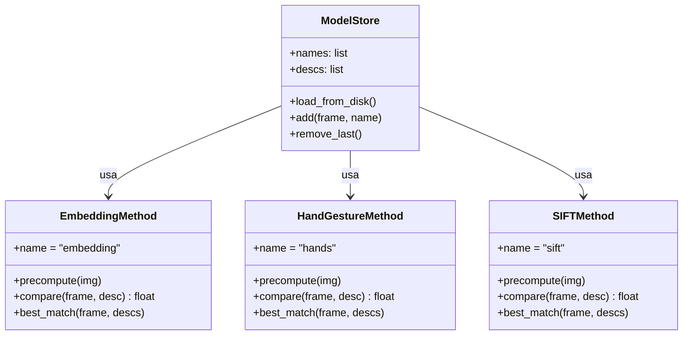
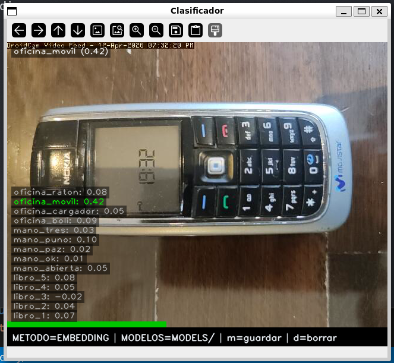
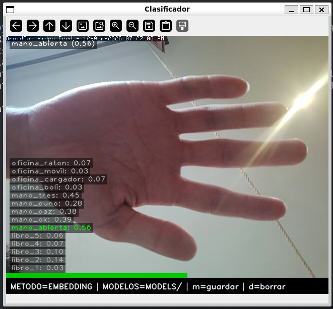
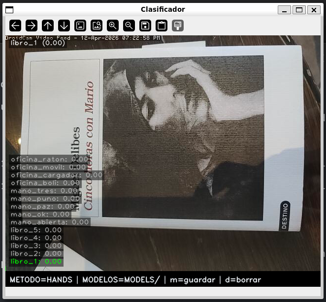
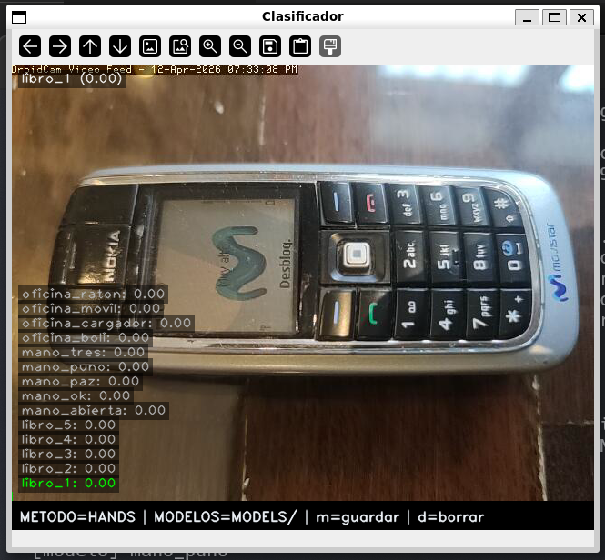
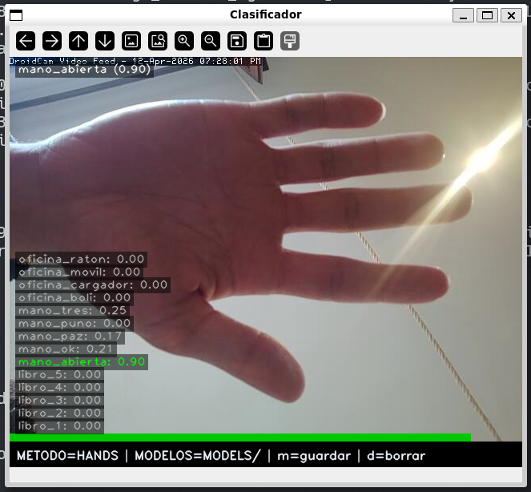
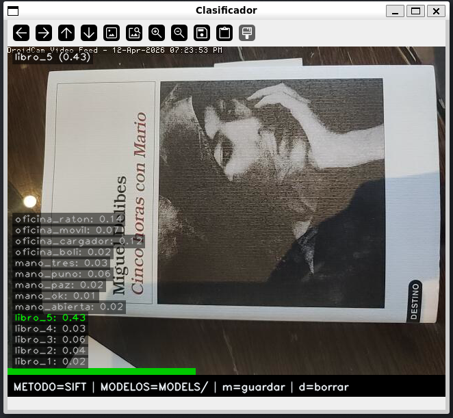
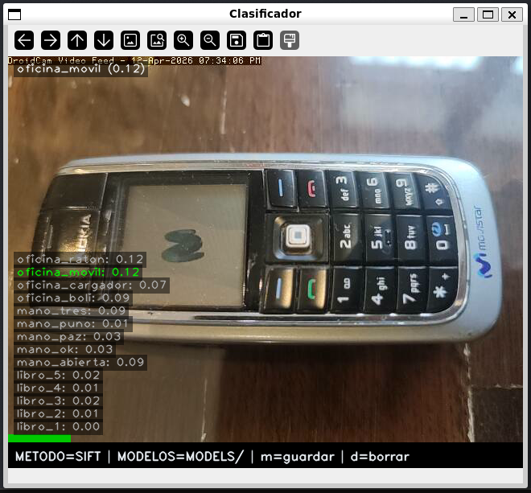
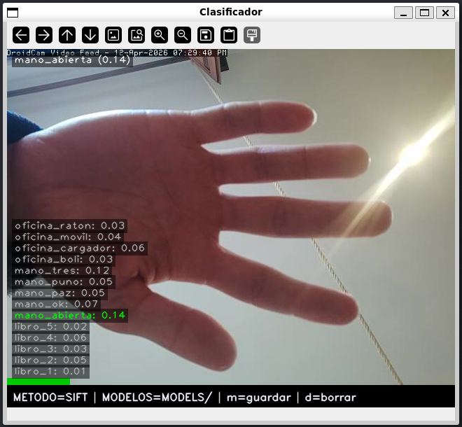

# Clasificador de Imágenes

## Descripción

`clasificador/clasificador.py` es una aplicación modular de reconocimiento en tiempo real. Acepta `--models` y `--method` como argumentos. Cada método implementa la misma interfaz (`precompute`, `compare`, `best_match`), lo que permite anadir nuevos métodos sin tocar el código principal.

---

## Requisitos y ejecución { #requisitos }

!!! info "Entorno"
    Python 3.10+, OpenCV 4.9, MediaPipe 0.10, SciPy (para Procrustes).

```bash
# Método por embedding (MobileNet V3)
python clasificador/clasificador.py --models=models/ --method=embedding

# Método por gestos de mano (Procrustes)
python clasificador/clasificador.py --models=models/ --method=hands

# Método por descriptores SIFT
python clasificador/clasificador.py --models=models/ --method=sift
```

!!! tip "Capturar modelos sobre la marcha"
    Pulsa `m` para capturar el frame actual como nuevo modelo. El descriptor se precomputa inmediatamente y queda disponible para el siguiente frame.

---

## Arquitectura { #arquitectura }



---

## Parámetros clave { #parametros }

### Comparativa de métodos

| Método | Objetos sin textura | Gestos | Robustez iluminación | Velocidad |
|--------|---------------------|--------|----------------------|-----------|
| Embedding | ✅ Buena | ⚠️ Regular | ✅ Alta | ~30 ms |
| Procrustes | N/A | ✅ Excelente | ✅ Alta | ~15 ms |
| SIFT | ❌ Mala | ❌ N/A | ⚠️ Media | ~50 ms |

### Parámetros por método

| Método | Parámetro | Valor | Descripción |
|--------|-----------|-------|-------------|
| Embedding | Dimensión vector | 1024 | Salida de MobileNet V3 Small |
| Embedding | Similitud | Coseno | Invariante a la magnitud del vector |
| Procrustes | `_DISPARITY_SCALE` | configurable | Penalización por diferencia de forma |
| SIFT | `_LOWE_RATIO` | 0.75 | Umbral de filtrado de matches ambiguos |
| Todos | Inferencia | cada 30 frames | Para no bloquear el bucle de captura |

!!! tip "Parámetro más sensible: `_DISPARITY_SCALE` (Procrustes)"
    Si es muy bajo, gestos distintos quedan demasiado cerca y hay confusiones. Si es muy alto, el mismo gesto con ligera variación deja de reconocerse. Ajústalo con el dataset de gestos propio.

!!! tip "SIFT y objetos sin textura"
    Con menos de ~10 coincidencias válidas tras el filtro de Lowe el resultado no es fiable. En superficies homogéneas (caja blanca, taza lisa) simplemente no hay suficientes keypoints detectables: usa `embedding` en esos casos.

---

## Código clave { #codigo }

### Método 1 — Embedding MediaPipe

<figure markdown>
  
  <figcaption>Embedding sobre la portada del libro: score 0.83 para <code>libro_5</code>, con separación clara respecto al resto (libro_4: 0.51). Funciona bien porque la red captura semántica visual global.</figcaption>
</figure>
<figure markdown>
  
  <figcaption>Embedding sobre el móvil Nokia: identifica correctamente <code>oficina_movil</code> con score 0.42. Pese a ser un score moderado, la separación con el segundo candidato es suficiente para clasificar bien.</figcaption>
</figure>
<figure markdown>
  
  <figcaption>Embedding sobre mano abierta: score 0.56. Reconoce el gesto pero con menos margen que Procrustes (0.90), ya que el embedding no está especializado en formas geométricas de landmarks.</figcaption>
</figure>

```python title="clasificador/methods/mp_embedding.py" linenums="1"
class EmbeddingMethod:
    name = "embedding"

    def _embed(self, img_bgr):
        rgb   = cv.cvtColor(img_bgr, cv.COLOR_BGR2RGB)
        mpimg = mp.Image(image_format=mp.ImageFormat.SRGB, data=rgb)
        return self._embedder.embed(mpimg).embeddings[0]

    def precompute(self, img_bgr):
        return self._embed(img_bgr)

    def compare(self, frame_bgr, descriptor) -> float:
        return float(
            vision.ImageEmbedder.cosine_similarity(
                self._embed(frame_bgr), descriptor
            )
        )
```

### Método 2 — Gestos de mano (Procrustes)

<figure markdown>
  
  <figcaption>Procrustes sobre el libro: todos los scores son 0.00. Sin mano visible en el frame, MediaPipe no detecta landmarks y el método devuelve similitud nula para todos los modelos.</figcaption>
</figure>
<figure markdown>
  
  <figcaption>Procrustes sobre el móvil Nokia: mismo resultado, scores a 0.00. El método es ciego a objetos que no sean manos.</figcaption>
</figure>
<figure markdown>
  
  <figcaption>Procrustes sobre mano abierta: score 0.90 para <code>mano_abierta</code>, con gran separación respecto al segundo candidato (mano_tres: 0.25). La normalización de traslación, escala y rotación hace que la forma pura del gesto se compare de forma muy precisa.</figcaption>
</figure>

```python title="clasificador/methods/hand_procrustes.py — compare()" linenums="1"
def compare(self, frame_bgr, descriptor) -> float:
    if descriptor is None: return 0.0
    pts = _extract_landmarks(self._detector, frame_bgr)
    if pts is None: return 0.0
    _, _, disparity = procrustes(descriptor, _normalize_shape(pts))
    return 1.0 / (1.0 + disparity * _DISPARITY_SCALE)
```

### Método 3 — SIFT

<figure markdown>
  
  <figcaption>SIFT sobre la portada del libro: score 0.43 para <code>libro_5</code>, con separación clara (libro_4: 0.03). La portada tiene abundante textura tipográfica e imagen, lo que genera muchos keypoints coincidentes tras el filtro de Lowe.</figcaption>
</figure>
<figure markdown>
  
  <figcaption>SIFT sobre el móvil Nokia: score 0.12 para <code>oficina_movil</code>. El teclado numérico ofrece algo de textura, pero la carcasa lisa limita el número de keypoints válidos, reduciendo el score respecto a embedding.</figcaption>
</figure>
<figure markdown>
  
  <figcaption>SIFT sobre mano abierta: score 0.14 para <code>mano_abierta</code>, con poca separación respecto a otros candidatos. La piel es una superficie casi sin textura: pocos keypoints detectables y resultado poco fiable.</figcaption>
</figure>

```python title="clasificador/methods/sift_matching.py — compare()" linenums="1"
_LOWE_RATIO = 0.75

def compare(self, frame_bgr, descriptor) -> float:
    if descriptor is None: return 0.0
    _, descs = self._sift.detectAndCompute(
        cv.cvtColor(frame_bgr, cv.COLOR_BGR2GRAY), None
    )
    if descs is None or len(descs) == 0: return 0.0
    good = [
        m for m, n in self._matcher.knnMatch(descs, descriptor, k=2)
        if m.distance < _LOWE_RATIO * n.distance
    ]
    return len(good) / max(min(len(descs), len(descriptor)), 1)
```

### Interfaz

<figure markdown>
  
  <figcaption>Captura de nuevo modelo con la tecla <code>m</code>. En la terminal se ve el flujo completo: el sistema solicita el nombre, guarda la imagen y la tiene disponible inmediatamente.</figcaption>
</figure>

---

## Análisis comparativo por tipo de objeto { #analisis }

Las capturas muestran de forma muy clara por qué cada método es más adecuado para un tipo de objeto concreto.

### Libro — SIFT gana

| Método | Score libro | Segundo candidato | Margen |
|--------|-------------|-------------------|--------|
| Embedding | 0.83 | 0.51 | +0.32 |
| SIFT | 0.43 | 0.03 | **+0.40** |
| Procrustes | 0.00 | 0.00 | — |

SIFT obtiene el mayor margen de separación sobre el libro (+0.40 frente a +0.32 de embedding). La portada es rica en textura: tipografía, contraste y fotografía con bordes definidos generan decenas de keypoints estables y reproducibles entre el modelo y el frame actual. Esa abundancia de puntos de anclaje locales es exactamente el escenario para el que SIFT está disenado. Embedding también clasifica bien, pero al comparar semántica global puede confundir portadas de libros similares; SIFT los distingue por sus keypoints concretos. Procrustes es completamente ciego: sin mano, devuelve 0.00.

### Mano abierta — Procrustes gana

| Método | Score mano | Segundo candidato | Margen |
|--------|------------|-------------------|--------|
| Procrustes | **0.90** | 0.25 | **+0.65** |
| Embedding | 0.56 | 0.45 | +0.11 |
| SIFT | 0.14 | 0.12 | +0.02 |

Procrustes domina con un margen de +0.65, muy superior al +0.11 de embedding y al casi nulo +0.02 de SIFT. La razón es estructural: Procrustes no mira píxeles sino la *forma geométrica* de los 21 landmarks que MediaPipe extrae de la mano. Al normalizar traslación, escala y rotación, compara únicamente la configuración relativa de los dedos, invariante a distancia, orientación e iluminación. Embedding lo intenta con semántica visual pero la piel es visualmente muy parecida entre gestos distintos, lo que comprime los scores (0.56 vs 0.45). SIFT falla porque la piel es una superficie sin textura: apenas hay keypoints que detectar.

### Móvil — Embedding gana

| Método | Score móvil | Segundo candidato | Margen |
|--------|-------------|-------------------|--------|
| Embedding | **0.42** | 0.17 | **+0.25** |
| SIFT | 0.12 | 0.09 | +0.03 |
| Procrustes | 0.00 | 0.00 | — |

Embedding es el único método que clasifica el móvil con un margen útil (+0.25). El Nokia tiene una carcasa lisa con muy poca textura repetible: la pantalla apagada y el plástico gris apenas generan keypoints SIFT estables entre tomas, de ahí el score de 0.12 con margen casi nulo (+0.03). Embedding, en cambio, captura la *forma global* del objeto: su silueta rectangular, la disposición del teclado y la pantalla quedan codificados en el vector de 1024 dimensiones de MobileNet, lo que permite reconocerlo aunque el ángulo o la iluminación varíen ligeramente. Procrustes, como siempre con objetos sin mano, devuelve 0.00.

!!! tip "Regla práctica"
    - Usa **SIFT** para objetos con superficie rica en textura (portadas, etiquetas, circuitos).
    - Usa **Procrustes** para gestos de mano: es el único método que ve forma y no apariencia.
    - Usa **Embedding** para objetos con forma global distintiva pero superficie lisa (electrónica, packaging).

---

## Decisiones de diseno { #decisiones }

### Interfaz común para los tres métodos

Los tres métodos implementan `precompute`, `compare` y `best_match`. `precompute` se llama una sola vez al cargar o capturar un modelo; `compare` lo usa en cada frame. Anadir un método nuevo es implementar esa interfaz y registrarlo en `--method` argparse, sin tocar el código principal.

### Embedding: similitud del coseno

MobileNet V3 Small produce vectores de 1024 dimensiones donde la dirección importa más que la magnitud — dos imágenes del mismo objeto bajo distinta iluminación tendrán vectores de módulo diferente pero orientación parecida. La distancia euclidiana penalizaría esa diferencia de módulo innecesariamente; el coseno la ignora. La contrapartida es que objetos semánticamente parecidos (un libro y una revista) pueden quedar cerca en el espacio de embeddings.

### Procrustes: invarianza como descriptor

MediaPipe Hands devuelve 21 landmarks en coordenadas de imagen. Usarlos directamente no funcionaría porque el mismo gesto cambia de posición, tamano y orientación. Procrustes normaliza traslación, escala y rotación antes de comparar, de forma que lo que se mide es solo la *forma* de la configuración de dedos (→ ver [`compare()`](#codigo), línea 28).

### SIFT: filtro de Lowe

El filtro de Lowe (`_LOWE_RATIO=0.75`) descarta los emparejamientos ambiguos: si el keypoint más cercano no es significativamente mejor que el segundo, el match se rechaza (→ ver [`compare()`](#codigo), línea 42). Sin este filtro el número de coincidencias falsas sube mucho, especialmente en fondos con patrones repetitivos.

### Inferencia cada 30 frames

Correr los tres métodos en cada frame es caro, especialmente SIFT (~50 ms). Saltar frames introduce un retardo de ~1 s a 30 fps, aceptable para reconocimiento de objetos estáticos o gestos mantenidos. Si se necesitara respuesta más rápida, la opción sería mover la inferencia a un hilo separado y actualizar el resultado cuando esté listo.

---

## Limitaciones { #limitaciones }

!!! warning "Limitaciones conocidas"
    - **Embedding**: confunde objetos semánticamente similares. Con pocos modelos puede haber empates.
    - **Procrustes**: requiere que MediaPipe detecte la mano. Falla con oclusiones o manos alejadas.
    - **SIFT**: muy lento con imágenes sin textura. Poco fiable con menos de ~10 coincidencias válidas.
    - La inferencia se realiza cada **30 frames**: el resultado puede estar ligeramente desactualizado.