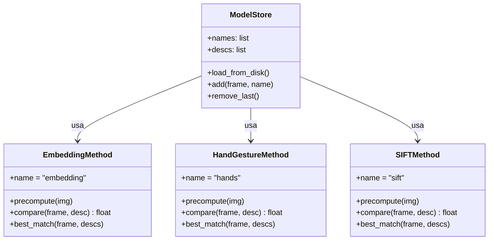
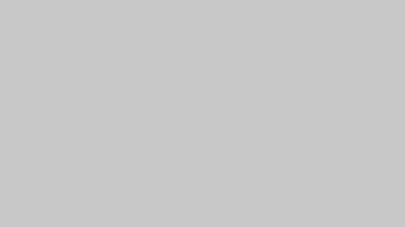
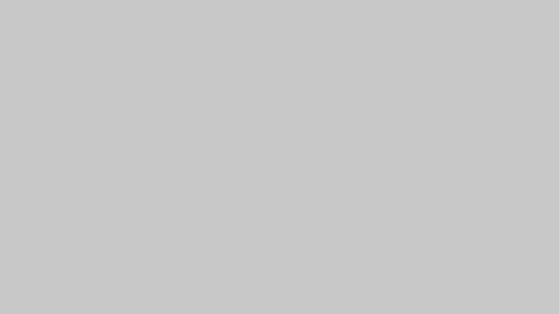

# Clasificador de Imágenes

## Descripción

`clasificador/clasificador.py` es una aplicación modular de reconocimiento en tiempo real. Acepta `--models` y `--method` como argumentos. Cada método implementa la misma interfaz (`precompute`, `compare`, `best_match`), lo que permite añadir nuevos métodos sin tocar el código principal.

---

## Requisitos y ejecución { #requisitos }

!!! info "Entorno"
    Python 3.10+, OpenCV 4.9, MediaPipe 0.10, SciPy (para Procrustes).

```bash
# Método por embedding (MobileNet V3)
python clasificador/clasificador.py --models=models/ --method=embedding

# Método por gestos de mano (Procrustes)
python clasificador/clasificador.py --models=models/ --method=hands

# Método por descriptores SIFT
python clasificador/clasificador.py --models=models/ --method=sift
```

!!! tip "Capturar modelos sobre la marcha"
    Pulsa `m` para capturar el frame actual como nuevo modelo. El descriptor se precomputa inmediatamente y queda disponible para el siguiente frame.

---

## Arquitectura { #arquitectura }



---

## Parámetros clave { #parametros }

### Comparativa de métodos

| Método | Objetos sin textura | Gestos | Robustez iluminación | Velocidad |
|--------|---------------------|--------|----------------------|-----------|
| Embedding | ✅ Buena | ⚠️ Regular | ✅ Alta | ~30 ms |
| Procrustes | N/A | ✅ Excelente | ✅ Alta | ~15 ms |
| SIFT | ❌ Mala | ❌ N/A | ⚠️ Media | ~50 ms |

### Parámetros por método

| Método | Parámetro | Valor | Descripción |
|--------|-----------|-------|-------------|
| Embedding | Dimensión vector | 1024 | Salida de MobileNet V3 Small |
| Embedding | Similitud | Coseno | Invariante a la magnitud del vector |
| Procrustes | `_DISPARITY_SCALE` | configurable | Penalización por diferencia de forma |
| SIFT | `_LOWE_RATIO` | 0.75 | Umbral de filtrado de matches ambiguos |
| Todos | Inferencia | cada 30 frames | Para no bloquear el bucle de captura |

!!! tip "Parámetro más sensible: `_DISPARITY_SCALE` (Procrustes)"
    Si es muy bajo, gestos distintos quedan demasiado cerca y hay confusiones. Si es muy alto, el mismo gesto con ligera variación deja de reconocerse. Ajústalo con el dataset de gestos propio.

!!! tip "SIFT y objetos sin textura"
    Con menos de ~10 coincidencias válidas tras el filtro de Lowe el resultado no es fiable. En superficies homogéneas (caja blanca, taza lisa) simplemente no hay suficientes keypoints detectables: usa `embedding` en esos casos.

---

## Código clave { #codigo }

### Método 1 — Embedding MediaPipe

<div class="img-grid-2">
<figure markdown>
  
  <figcaption>Método embedding reconociendo un libro. La barra verde indica la similitud con el modelo más cercano.</figcaption>
</figure>
<figure markdown>
  
  <figcaption>Reconocimiento de objeto de oficina con el método embedding.</figcaption>
</figure>
</div>

```python title="clasificador/methods/mp_embedding.py" linenums="1"
class EmbeddingMethod:
    name = "embedding"

    def _embed(self, img_bgr):
        rgb   = cv.cvtColor(img_bgr, cv.COLOR_BGR2RGB)
        mpimg = mp.Image(image_format=mp.ImageFormat.SRGB, data=rgb)
        return self._embedder.embed(mpimg).embeddings[0]

    def precompute(self, img_bgr):
        return self._embed(img_bgr)

    def compare(self, frame_bgr, descriptor) -> float:
        return float(
            vision.ImageEmbedder.cosine_similarity(
                self._embed(frame_bgr), descriptor
            )
        )
```

### Método 2 — Gestos de mano (Procrustes)

<div class="img-grid-2">
<figure markdown>
  
  <figcaption>Reconocimiento del gesto "rock" mediante distancia Procrustes.</figcaption>
</figure>
<figure markdown>
  
  <figcaption>Reconocimiento del gesto "paz". Los landmarks son invariantes a traslación, rotación y escala.</figcaption>
</figure>
</div>

<figure markdown>
  
  <figcaption>Dataset de gestos: rock, puño, paz, ok, índice, meñique.</figcaption>
</figure>

```python title="clasificador/methods/hand_procrustes.py — compare()" linenums="1"
def compare(self, frame_bgr, descriptor) -> float:
    if descriptor is None: return 0.0
    pts = _extract_landmarks(self._detector, frame_bgr)
    if pts is None: return 0.0
    _, _, disparity = procrustes(descriptor, _normalize_shape(pts))
    return 1.0 / (1.0 + disparity * _DISPARITY_SCALE)
```

### Método 3 — SIFT

<div class="img-grid-2">
<figure markdown>
  
  <figcaption>SIFT reconociendo portada de libro. Funciona bien con objetos de alta textura.</figcaption>
</figure>
<figure markdown>
  
  <figcaption>Keypoints SIFT detectados en el frame. Solo los que superan el ratio de Lowe se cuentan.</figcaption>
</figure>
</div>

```python title="clasificador/methods/sift_matching.py — compare()" linenums="1"
_LOWE_RATIO = 0.75

def compare(self, frame_bgr, descriptor) -> float:
    if descriptor is None: return 0.0
    _, descs = self._sift.detectAndCompute(
        cv.cvtColor(frame_bgr, cv.COLOR_BGR2GRAY), None
    )
    if descs is None or len(descs) == 0: return 0.0
    good = [
        m for m, n in self._matcher.knnMatch(descs, descriptor, k=2)
        if m.distance < _LOWE_RATIO * n.distance
    ]
    return len(good) / max(min(len(descs), len(descriptor)), 1)
```

### Interfaz

<div class="img-grid-2">
<figure markdown>
  
  <figcaption>Barra de similitud global. El modelo ganador aparece en verde.</figcaption>
</figure>
<figure markdown>
  
  <figcaption>Captura de nuevo modelo con la tecla <code>S</code>.</figcaption>
</figure>
</div>

---

## Decisiones de diseño { #decisiones }

### Interfaz común para los tres métodos

Los tres métodos implementan `precompute`, `compare` y `best_match`. `precompute` se llama una sola vez al cargar o capturar un modelo; `compare` lo usa en cada frame. Añadir un método nuevo es implementar esa interfaz y registrarlo en `--method` argparse, sin tocar el código principal.

### Embedding: similitud del coseno

MobileNet V3 Small produce vectores de 1024 dimensiones donde la dirección importa más que la magnitud — dos imágenes del mismo objeto bajo distinta iluminación tendrán vectores de módulo diferente pero orientación parecida. La distancia euclidiana penalizaría esa diferencia de módulo innecesariamente; el coseno la ignora. La contrapartida es que objetos semánticamente parecidos (un libro y una revista) pueden quedar cerca en el espacio de embeddings.

### Procrustes: invarianza como descriptor

MediaPipe Hands devuelve 21 landmarks en coordenadas de imagen. Usarlos directamente no funcionaría porque el mismo gesto cambia de posición, tamaño y orientación. Procrustes normaliza traslación, escala y rotación antes de comparar, de forma que lo que se mide es solo la *forma* de la configuración de dedos (→ ver [`compare()`](#codigo), línea 28).

### SIFT: filtro de Lowe

El filtro de Lowe (`_LOWE_RATIO=0.75`) descarta los emparejamientos ambiguos: si el keypoint más cercano no es significativamente mejor que el segundo, el match se rechaza (→ ver [`compare()`](#codigo), línea 42). Sin este filtro el número de coincidencias falsas sube mucho, especialmente en fondos con patrones repetitivos.

### Inferencia cada 30 frames

Correr los tres métodos en cada frame es caro, especialmente SIFT (~50 ms). Saltar frames introduce un retardo de ~1 s a 30 fps, aceptable para reconocimiento de objetos estáticos o gestos mantenidos. Si se necesitara respuesta más rápida, la opción sería mover la inferencia a un hilo separado y actualizar el resultado cuando esté listo.

---

## Limitaciones { #limitaciones }

!!! warning "Limitaciones conocidas"
    - **Embedding**: confunde objetos semánticamente similares. Con pocos modelos puede haber empates.
    - **Procrustes**: requiere que MediaPipe detecte la mano. Falla con oclusiones o manos alejadas.
    - **SIFT**: muy lento con imágenes sin textura. Poco fiable con menos de ~10 coincidencias válidas.
    - La inferencia se realiza cada **30 frames**: el resultado puede estar ligeramente desactualizado.