# Deep Learning — Detector YOLO

## Descripción

Fine-tuning de **YOLO11n** (Ultralytics) sobre un dataset propio de objetos domésticos con tres clases: `book`, `fruit`, `toy`. La inferencia corre en un hilo separado para no bloquear el stream de vídeo.

---

## Requisitos y ejecución { #requisitos }

!!! info "Entorno"
    Python 3.10+, Ultralytics 8.x, PyTorch 2.x.

```bash
# Entrenar el modelo (genera best.pt en runs/detect/train/weights/)
python dl/train.py

# Inferencia en tiempo real
python dl/run.py
```

!!! warning "Fichero de modelo necesario"
    `run.py` lanza `FileNotFoundError` si `best.pt` no existe en la ruta esperada. Ejecuta `train.py` al menos una vez antes de lanzar la inferencia.

!!! tip "Métricas tras el entrenamiento"
    Los valores de mAP50, Precisión y Recall se encuentran en la **última fila** de `runs/detect/train/results.csv`, en las columnas `metrics/mAP50(B)`, `metrics/mAP50-95(B)`, `metrics/precision(B)` y `metrics/recall(B)`.

---

## Arquitectura { #arquitectura }

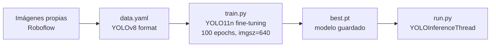

### Dataset

<figure markdown>
  
  <figcaption>Muestra representativa de las 3 clases etiquetadas en Roboflow.</figcaption>
</figure>

<figure markdown>
  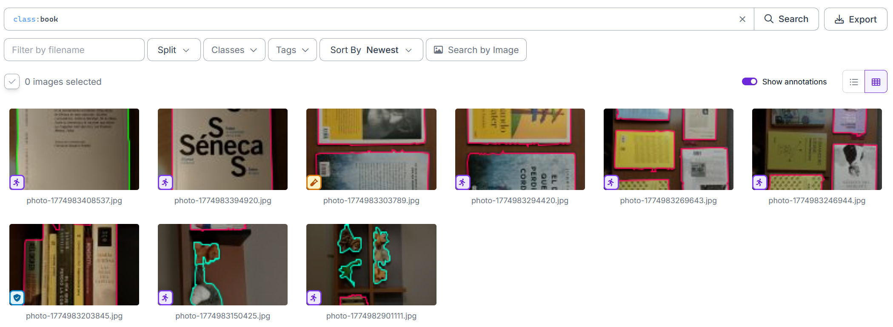
  <figcaption>Clase <em>book</em> con bounding boxes en formato YOLO.</figcaption>
</figure>

<figure markdown>
  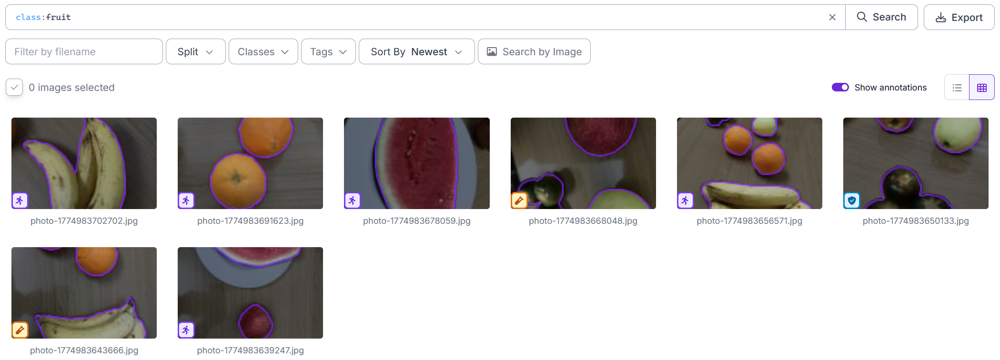
  <figcaption>Clase <em>fruit</em>. La variedad de frutas hace esta clase más difícil de generalizar.</figcaption>
</figure>

<figure markdown>
  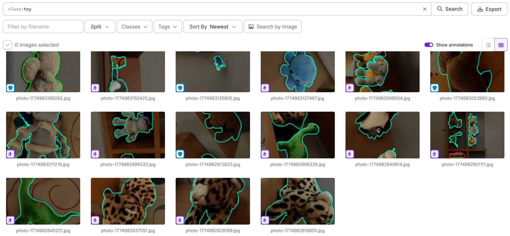
  <figcaption>Clase <em>toy</em> con sus anotaciones.</figcaption>
</figure>

---

## Parámetros clave { #parametros }

### Dataset

| Parámetro | Valor |
|-----------|-------|
| Clases | `book`, `fruit`, `toy` |
| Imágenes totales | 30 |
| Formato | YOLOv8 (YOLO txt labels) |
| Fuente | Roboflow (workspace: viaael) |

### Entrenamiento

| Parámetro | Valor | Descripción |
|-----------|-------|-------------|
| `BASE_MODEL` | `yolo11n.pt` | Preentrenado en COCO |
| `EPOCHS` | 100 | Épocas de fine-tuning |
| `IMGSZ` | 640 | Resolución de entrenamiento |
| `HSV_S` | 0.7 | Aumentación de saturación |
| `HSV_V` | 0.4 | Aumentación de brillo |
| `SCALE` | 0.5 | Aumentación de escala |
| `DEGREES` | 15 | Rotación máxima |

!!! tip "Parámetros de aumentación"
    Con solo 30 imágenes, la aumentación es crítica. `HSV_S=0.7` y `HSV_V=0.4` cubren variaciones fuertes de iluminación; `SCALE=0.5` simula diferentes distancias al objeto. Sin aumentación el modelo sobreajustaría en pocas épocas.

### Inferencia

| Parámetro | Valor | Descripción |
|-----------|-------|-------------|
| `INFER_SIZE` | 320 px | Resolución de inferencia (reducida para velocidad) |
| `CONF_THRESH` | configurable | Umbral de confianza para mostrar detección |

!!! tip "INFER_SIZE: precisión vs latencia"
    A `imgsz=640` la inferencia tarda ~250 ms en CPU — demasiado para el bucle principal. Con `INFER_SIZE=320` baja a ~80 ms a costa de algo de precisión en objetos pequenos.

---

## Código clave { #codigo }

### Entrenamiento

```python title="dl/train.py — hiperparámetros" linenums="1"
BASE_MODEL = "yolo11n.pt"   # preentrenado en COCO
EPOCHS     = 100
IMGSZ      = 640

# Aumentación de color
HSV_H, HSV_S, HSV_V = 0.3, 0.7, 0.4

# Aumentación geométrica
FLIPLR, DEGREES, SCALE, TRANSLATE = 0.5, 15, 0.5, 0.2

model = YOLO(BASE_MODEL)
model.train(
    data=str(DATA_YAML), epochs=EPOCHS, imgsz=IMGSZ,
    augment=True,
    hsv_h=HSV_H, hsv_s=HSV_S, hsv_v=HSV_V,
    fliplr=FLIPLR, degrees=DEGREES, scale=SCALE, translate=TRANSLATE,
)
```

### Resultados del entrenamiento

<figure markdown>
  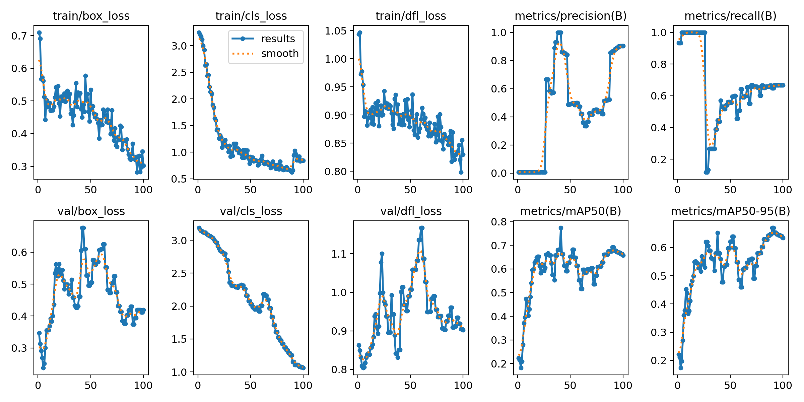
  <figcaption>Curvas de pérdida (box_loss, cls_loss, dfl_loss) y métricas mAP50 / mAP50-95 a lo largo de las 100 épocas.</figcaption>
</figure>

<figure markdown>
  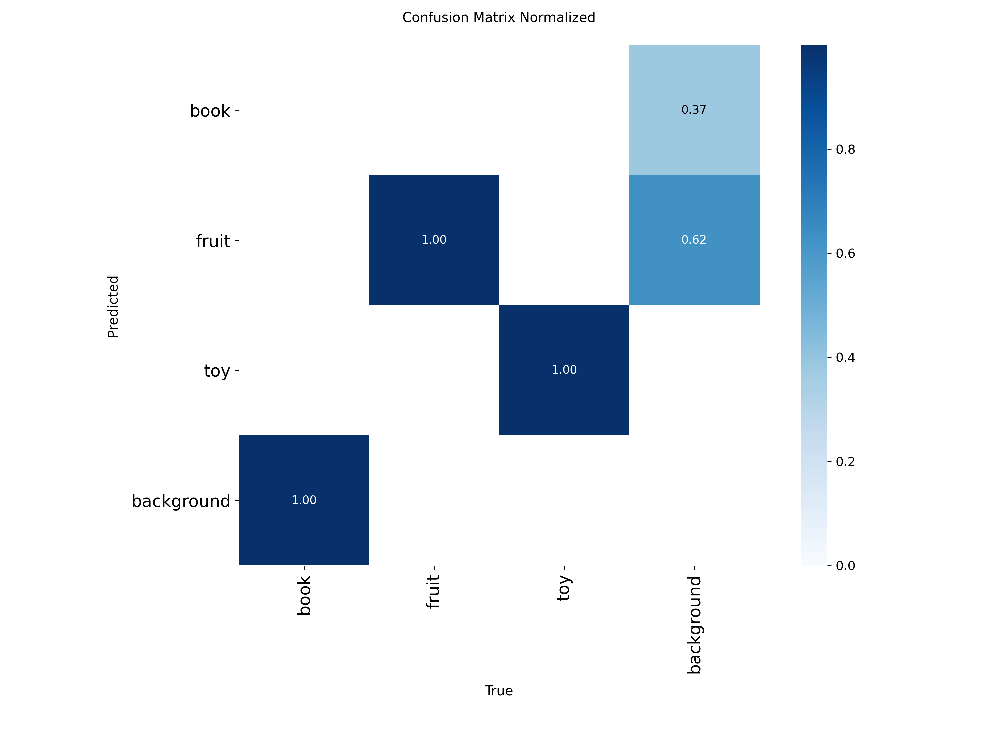
  <figcaption>Matriz de confusión normalizada sobre el conjunto de validación.</figcaption>
</figure>

<figure markdown>
  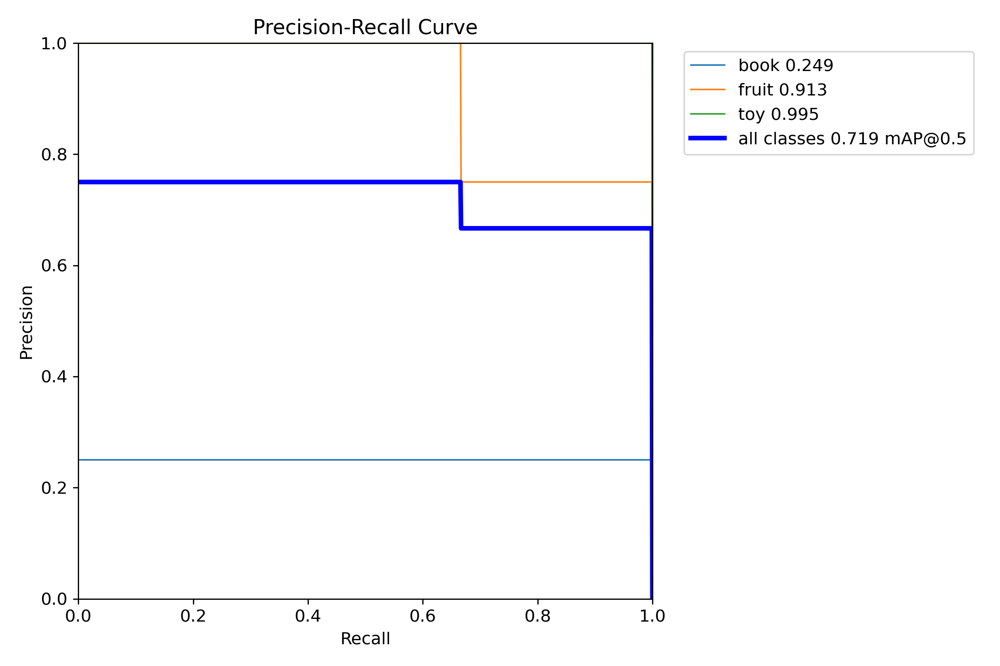
  <figcaption>Curva Precisión-Recall por clase. El área bajo la curva equivale al mAP50.</figcaption>
</figure>

<div class="metric-grid">
  <div class="metric-card">
    <span class="metric-value">—</span>
    <span class="metric-label">mAP50</span>
  </div>
  <div class="metric-card">
    <span class="metric-value">—</span>
    <span class="metric-label">mAP50-95</span>
  </div>
  <div class="metric-card">
    <span class="metric-value">—</span>
    <span class="metric-label">Precisión</span>
  </div>
  <div class="metric-card">
    <span class="metric-value">—</span>
    <span class="metric-label">Recall</span>
  </div>
</div>

!!! info "Cómo rellenar las métricas"
    Tras ejecutar `train.py`, abre `runs/detect/train/results.csv` y copia los valores de la **última fila** en las tarjetas de arriba:
    `metrics/mAP50(B)` → mAP50, `metrics/mAP50-95(B)` → mAP50-95, `metrics/precision(B)` → Precisión, `metrics/recall(B)` → Recall.


## Análisis de las gráficas { #analisis }
 
### Curvas de entrenamiento (`training_curves.png`)
 
**Pérdidas de entrenamiento (fila superior izquierda):**
 
Las tres pérdidas de entrenamiento (`box_loss`, `cls_loss`, `dfl_loss`) descienden de forma consistente a lo largo de las 100 épocas, lo que indica que el modelo aprende correctamente. La `cls_loss` es la que más cae en términos absolutos (de ~3.3 a ~0.5), reflejando que la clasificación entre las tres clases mejora progresivamente.
 
**Pérdidas de validación (fila inferior izquierda):**
 
La `val/box_loss` y la `val/cls_loss` también descienden, aunque con más ruido que las de entrenamiento. La `val/dfl_loss` presenta un pico pronunciado alrededor de la época 55 seguido de recuperación; esto es habitual con datasets muy pequenos donde un solo ejemplo difícil puede distorsionar la métrica. El hecho de que las pérdidas de validación no suban sostenidamente indica que no hay sobreajuste severo, aunque el margen entre train y val es estrecho precisamente por el pequeno tamano del dataset.
 
**Métricas (columnas derechas):**
 
- `metrics/precision(B)`: Muy inestable en las primeras épocas (sube a ~1.0 y cae a ~0.0 antes de estabilizarse). Esto es característico de datasets pequenos donde pocas predicciones correctas o incorrectas cambian la precisión drásticamente. Se estabiliza en torno a 0.85–0.93 a partir de la época 40.
- `metrics/recall(B)`: Parte alto (~0.96), cae bruscamente (~época 5) y recupera gradualmente hasta ~0.63 al final. La caída coincide con la inestabilidad de precisión; el modelo al principio detecta casi todo (recall alto, precisión baja) y luego calibra su umbral.
- `metrics/mAP50(B)`: Crece desde ~0.2 hasta ~0.67–0.75 con oscilaciones. La tendencia es claramente ascendente, confirmando que el entrenamiento es beneficioso.
- `metrics/mAP50-95(B)`: Comportamiento similar al mAP50 pero con valores menores (~0.20 → ~0.65), lo cual es esperado ya que mide precisión a umbrales de IoU más estrictos.
 
!!! warning "Interpretación con cautela"
    Las oscilaciones fuertes en precisión y recall no indican inestabilidad del entrenamiento, sino la alta varianza estadística causada por el pequeno conjunto de validación. Con 30 imágenes en total, el split val puede contener apenas 5–8 imágenes, haciendo que cada falso positivo o negativo mueva la métrica varios puntos porcentuales.
 
---
 
### Matriz de confusión (`training_confusion_matrix.png`)
 
La matriz está normalizada por columnas (true label), por lo que cada columna suma 1.0 en las clases con predicciones.
 
**Resultados por clase:**
 
- **`fruit`**: Recall perfecto (1.00) — todas las instancias de fruta son correctamente detectadas como `fruit`. No hay confusión con otras clases de objeto.
- **`toy`**: Recall perfecto (1.00) — ídem para juguetes.
- **`book`**: **Problema.** Ninguna instancia de `book` se detecta correctamente como tal. En cambio, el 37% se predice como `book` cuando la etiqueta real es `background`, y el 62% de las predicciones de `book` corresponden también a `background`. Esto indica que el modelo no ha aprendido bien la clase `book`: confunde regiones de fondo con libros, pero no detecta los libros reales.
- **`background`**: Recall perfecto (1.00) — las regiones de fondo se rechazan correctamente.
 
!!! danger "Clase `book` problemática"
    La ausencia de detecciones correctas de `book` (diagonal vacía para esa clase) es la principal debilidad del modelo. Las causas posibles son: pocas imágenes de entrenamiento de esa clase, variabilidad alta en apariencia (tamano, color, orientación del libro), o solapamiento visual con el fondo. Soluciones: ampliar el dataset de `book`, o aplicar aumentaciones específicas como recortes aleatorios más agresivos.
 
---
 
### Curva Precisión-Recall (`training_pr_curve.png`)
 
La curva muestra el área bajo la curva (AP@0.5) por clase:
 
| Clase | AP@0.5 | Interpretación |
|-------|--------|----------------|
| `book` | 0.249 | Muy bajo — consistente con la matriz de confusión |
| `fruit` | 0.913 | Excelente — el modelo detecta frutas con alta confiabilidad |
| `toy` | 0.995 | Casi perfecto — detección de juguetes muy robusta |
| **all classes** | **0.719** | **mAP@0.5 global — razonable para 30 imágenes** |
 
**Observaciones:**
 
- La curva de `toy` (verde) es prácticamente un cuadrado perfecto: precisión alta para todo el rango de recall, indicando detecciones muy confiables a cualquier umbral.
- La curva de `fruit` (naranja) mantiene precisión ~0.75 hasta recall ~0.65, luego sube a 1.0 (solo detecta cuando está muy seguro) antes de caer. Comportamiento típico de una clase bien aprendida con pocos ejemplos.
- La curva de `book` (azul claro) es casi plana y baja (~0.25), confirmando que el modelo apenas discrimina esta clase del fondo.
- El **mAP50 global de 0.719** es un resultado razonable considerando el dataset de solo 30 imágenes, pero está muy sesgado al alza por el excelente rendimiento en `toy` y `fruit`. Sin `book`, el modelo no sería útil en un entorno real.
 
---

### Inferencia en tiempo real

<figure markdown>
  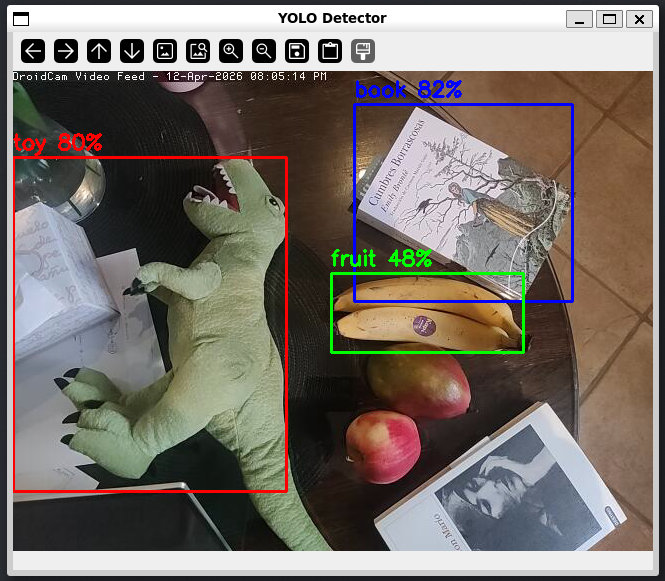
  <figcaption>Inferencia simultánea con múltiples objetos. Azul = book, verde = fruit, rojo = toy.</figcaption>
</figure>

<figure markdown>
  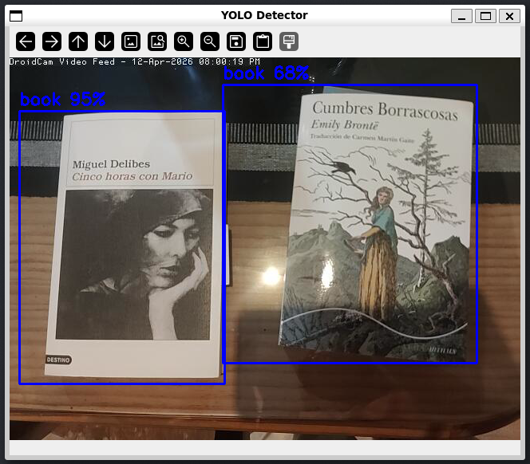
  <figcaption>Detección de la clase <em>book</em> con confianza mostrada sobre el bbox.</figcaption>
</figure>
<figure markdown>
  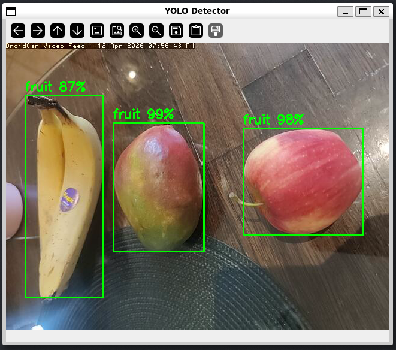
  <figcaption>Detección de la clase <em>fruit</em>.</figcaption>
</figure>

<figure markdown>
  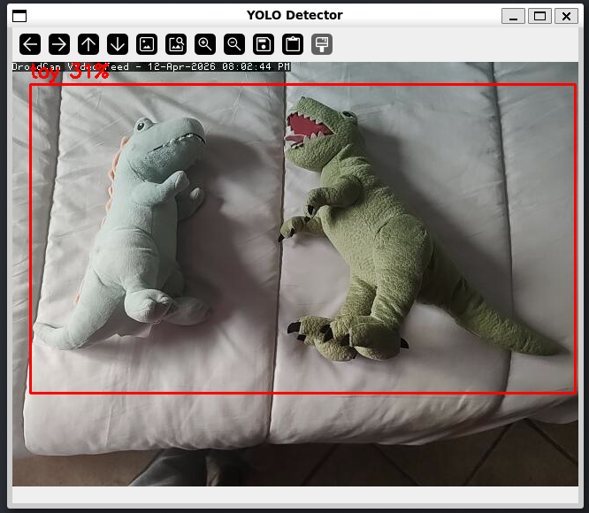
  <figcaption>Detección de la clase <em>toy</em>.</figcaption>
</figure>

```python title="dl/run.py — hilo de inferencia" linenums="1"
class YOLOInferenceThread(threading.Thread):
    def run(self) -> None:
        while self.running:
            frame = self.buf.read()
            if frame is None: continue
            rgb = cv.cvtColor(frame, cv.COLOR_BGR2RGB)
            [res] = self.model(rgb, imgsz=INFER_SIZE, conf=CONF_THRESH)
            with self.lock:
                self._boxes = res.boxes   # compartido con hilo principal
```

---

## Decisiones de diseno { #decisiones }

### YOLO11n y fine-tuning sobre COCO

YOLO11n es la variante más ligera — menos parámetros, más rápida en CPU, suficiente para tres clases sobre objetos domésticos grandes. Partir de los pesos preentrenados en COCO tiene sentido porque COCO ya incluye categorías visualmente parecidas a `book`, `fruit` y `toy`; el fine-tuning solo ajusta las capas finales a las clases propias. Con 30 imágenes, entrenar desde cero no sería viable.

### Aumentación agresiva para compensar el dataset pequeno

Con solo 30 imágenes el modelo vería exactamente los mismos ejemplos cientos de veces en 100 épocas sin aumentación (→ ver parámetros en [`train.py`](#codigo), línea 1). El riesgo es que con un dataset tan pequeno el split train/val puede acabar con ejemplos de validación muy parecidos a los de entrenamiento, haciendo las métricas más optimistas de lo que son en la práctica.

### Hilo de inferencia separado

YOLO11n a `imgsz=640` tarda ~250 ms en CPU. `YOLOInferenceThread` (→ ver [`run.py`](#codigo), línea 24) lee frames de un buffer compartido, corre la inferencia y escribe los resultados bajo un lock. El hilo principal dibuja los bounding boxes del último resultado disponible sin esperar al siguiente, manteniendo el stream fluido.

### `fruit` como clase problemática

`book` y `toy` son categorías visualmente compactas. `fruit` agrupa objetos con formas, colores y tamanos muy distintos (manzana, plátano, naranja). Con pocas imágenes por subclase el modelo aprende rasgos específicos y generaliza mal. La solución sería restringir la clase a una sola fruta o aumentar el dataset en esa categoría concreta.

---

## Limitaciones { #limitaciones }

!!! warning "Limitaciones conocidas"
    - Dataset muy pequeno (30 imágenes): el modelo puede sobreajustarse a condiciones de captura específicas.
    - El split train/val usa el mismo conjunto; las métricas de validación son optimistas.
    - La clase `fruit` es muy heterogénea (manzana, plátano, naranja…): la generalización es más difícil.
    - Si `best.pt` no existe, `run.py` lanza `FileNotFoundError` inmediatamente.