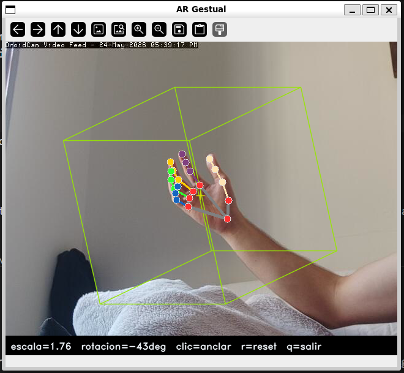
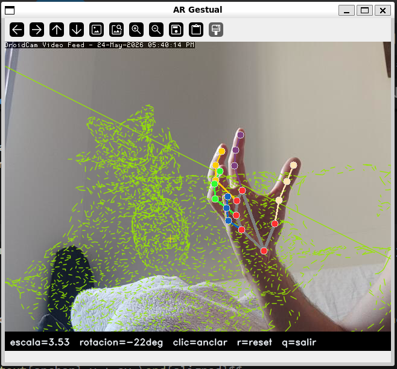
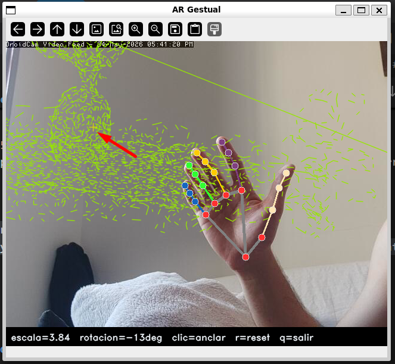

# Ej. 7 — Realidad Aumentada Gestual (Optimizado)

!!! abstract "Enunciado"
    Crea un efecto de realidad aumentada en el que el usuario desplace objetos virtuales hacia posiciones marcadas con el ratón, controlando su escala y rotación en tiempo real de forma fluida.

---

## Parámetros clave { #parametros }

| Parámetro | Valor | Descripción |
|-----------|-------|-------------|
| `_BASE_PX` | 80/200 px | Radio base dinámico en píxeles. Se autoajusta a `80` para el cubo por defecto y a `200` al cargar modelos `.obj` complejos para optimizar su visibilidad. |
| `_SCALE_MIN` | 0.1 | Escala mínima del objeto AR (mano lejana) |
| `_SCALE_MAX` | 4.5 | Escala máxima del objeto AR (mano cerca) |
| `_XY_FRAC` | 0.60 | Fracción del ancho/alto del frame para el offset XY de palma |
| `_SMOOTH` | 0.25 | Coeficiente α del filtro exponencial (escala, yaw, XY) |
| `_SMOOTH_RY` | 0.18 | Coeficiente α del filtro exponencial para roll (más conservador) |
| `max_edges` | 2 000 - 4 000 | Límite de aristas al cargar un modelo `.obj` denso (valores menores aumentan los FPS) |

---

## Carga del modelo y corrección de orientación { #modelo }

`ARViewer` admite un fichero `.obj` generado por reconstrucción 3D (como COLMAP o VGGT); si no se especifica u ocurre un error, utiliza un **cubo unitario de referencia**.

Debido a que OpenCV utiliza un sistema de coordenadas de pantalla donde el eje Y crece hacia abajo, los modelos tradicionales se cargan invertidos ("boca abajo"). Para solucionar esto sin sobrecargar el bucle de renderizado, **se invierte físicamente el signo del eje Y en la matriz de vértices** inmediatamente después de la lectura del archivo:

```python title="extra_8_7_2/ar_viewer.py — load() con corrección de orientación" linenums="1"
def load(self, path: str | Path) -> None:
    v, e = load_obj(path)
    
    # Corrección de orientación: invierte el eje Y para contrarrestar el sistema de OpenCV
    v[:, 1] = v[:, 1] * -1  

    self._verts = _normalize(v)
    self._edges = e
    print(f"[AR] {Path(path).name}: {len(v)} verts, {len(e)} aristas")
```

El asistente `load_obj` maneja dos casos:

- **Mallas con caras** (`.obj` con líneas `f`): extrae aristas únicas de cada polígono.
- **Nubes de puntos sin caras** (salida típica de COLMAP/VGGT exportada directamente): computa el `ConvexHull` de los vértices para derivar aristas y mostrar la envolvente del objeto.

```python title="extra_8_7_2/ar_viewer.py — load_obj() gestión de nube de puntos" linenums="1"
if not edges:
    from scipy.spatial import ConvexHull
    hull = ConvexHull(arr)
    for simplex in hull.simplices:
        for k in range(len(simplex)):
            a, b = int(simplex[k]), int(simplex[(k + 1) % len(simplex)])
            edges.add((min(a, b), max(a, b)))
```

---

## Anclaje con ratón y desplazamiento gestual { #anclaje }

<figure markdown>
  
  <figcaption>Cubo de referencia proyectado sobre la imagen con el marcador de anclaje (cruz amarilla). Un clic izquierdo mueve el ancla a cualquier posición de la imagen.</figcaption>
</figure>

<figure markdown>
  
  <figcaption>Modelo 3D reconstruido cargado en el visor AR. La mano (visible en la esquina) controla la escala y rotación en tiempo real.</figcaption>
</figure>

El objeto se posiciona dinámicamente combinando un punto de anclaje estático fijo y un desfase continuo controlado por la palma de la mano:

$$\begin{aligned} cx &= \text{anchor}_x + ox \\ cy &= \text{anchor}_y + oy \end{aligned}$$

Los desfases se derivan de la posición normalizada de la palma devuelta por MediaPipe:

```python title="extra_8_7_2/ar_viewer.py — update()" linenums="1"
target_ox = (state.norm_x - 0.5) * w * self._XY_FRAC   # _XY_FRAC = 0.60
target_oy = (state.norm_y - 0.5) * h * self._XY_FRAC
```

Cuando la palma está perfectamente centrada (`norm = 0.5`), el desfase es nulo y el objeto geométrico descansa exactamente sobre la cruz de anclaje amarilla definida por el clic del usuario. Desplazando la palma se puede arrastrar el objeto hasta ±30 % del ancho/alto del frame a partir del ancla.

<figure markdown>
  
  <figcaption>Secuencia: clic sobre una nueva posición y el objeto salta al ancla marcada. La mano retoma el control de offset y rotación desde ese punto.</figcaption>
</figure>

---

## Renderizado de alto rendimiento (Vectorizado) { #renderizado }

Para evitar caídas de frames y tirones al procesar modelos con alta densidad de polígonos (como nubes de puntos detalladas), se prescinde por completo de los bucles iterativos tradicionales de Python (`for ... cv.line`).

En su lugar, el renderizado se delega de forma nativa a las rutinas optimizadas de OpenCV en C++ agrupando todas las conexiones en matrices de segmentos independientes utilizando `cv.polylines`:

```python title="extra_8_7_2/ar_viewer.py — draw() optimizado con cv.polylines" linenums="1"
def draw(self, frame: np.ndarray) -> None:
    R    = _Ry(self._ry) @ _Rx(self._rx)
    rot  = (R @ self._verts.T).T
    px   = self._BASE_PX * self._scale
    cx   = self._anchor[0] + self._ox
    cy   = self._anchor[1] + self._oy
    
    # Proyección ortográfica simplificada
    pts  = rot[:, :2].copy()
    pts[:, 0] = pts[:, 0] * px + cx
    pts[:, 1] = pts[:, 1] * -px + cy 
    ipts = pts.astype(np.int32)

    # Renderizado masivo vectorizado en un único paso de ejecución
    if self._edges:
        edges_arr = np.array(self._edges, dtype=np.int32)
        lines = ipts[edges_arr] # Matriz con forma (N, 2, 2)
        
        cv.polylines(frame, lines, isClosed=False, color=(0, 230, 150), thickness=1, lineType=cv.LINE_AA)

    # Indicador visual del punto de anclaje fijo
    cv.drawMarker(frame, (int(cx), int(cy)), (0, 220, 220), cv.MARKER_CROSS, 14, 1, cv.LINE_AA)
```

---

## Decisiones de diseño { #decisiones }

### Separación ancla / offset

El ratón fija el centro del objeto (ancla) y la mano solo aplica un offset relativo. Esto permite anclar el objeto sobre un elemento de la escena con precisión y luego moverlo con la mano sin tener que mantener la palma exactamente en ese punto.

### Vectorización de geometría

Pasar de un procesado secuencial por línea a una inyección masiva con `cv.polylines` reduce el overhead de la máquina virtual de Python de forma crítica, permitiendo tasas estables por encima de los **60 FPS** en hardware convencional.

### Sacrificio de Z-Depth dinámico

Se ha eliminado la modulación dinámica de color basada en la profundidad individual de la arista (`z-depth`). Aunque este efecto aportaba pistas visuales de volumen, el coste de calcular el color arista por arista en Python destruía la experiencia interactiva en tiempo real. Se ha priorizado la fluidez absoluta utilizando un color plano optimizado.

### Suavizado exponencial asimétrico

Se mantienen factores de atenuación diferenciados (`0.25` frente a `0.18`). El valor más estricto se aplica al cabeceo (*roll*), absorbiendo de forma eficaz el ruido inherente que sufre la estimación de profundidad Z en el pipeline de tracking gestual.

---

## Limitaciones { #limitaciones }

!!! warning "Limitaciones conocidas"
    - La proyección sigue siendo **ortográfica**: no existe corrección perspectiva real ni puntos de fuga, por lo que el objeto no varía su tamaño relativo según su posición tridimensional respecto al eje óptico de la cámara.
    - Con modelos complejos (muchos vértices), el `ConvexHull` para nubes sin caras puede ser muy lento o producir geometría incorrecta.
    - Modelos con densidades masivas que superen las decenas de miles de aristas requerirán un submuestreo más agresivo mediante el ajuste del parámetro `max_edges` en la inicialización para salvaguardar el rendimiento de la CPU.