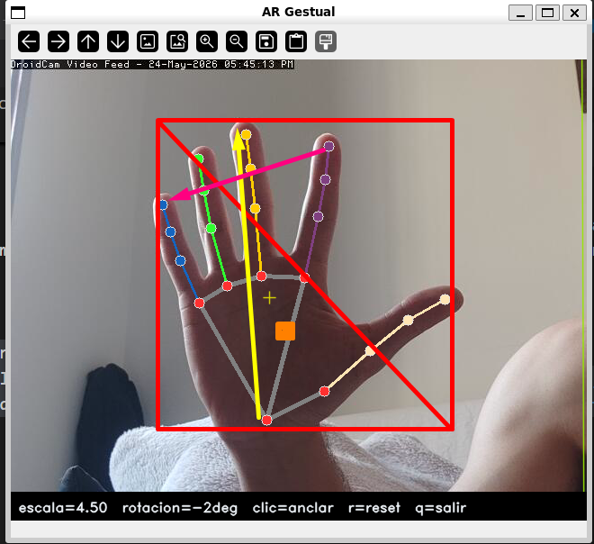
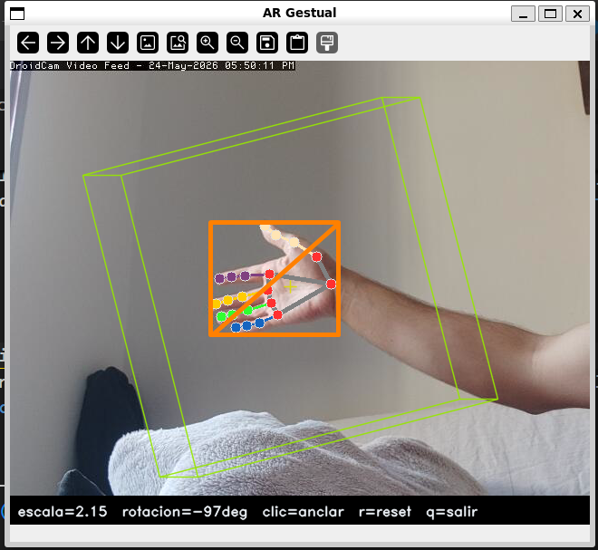
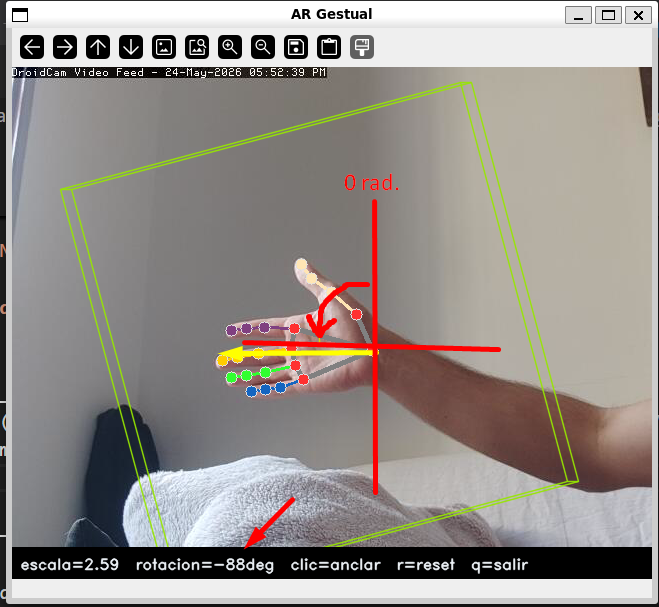
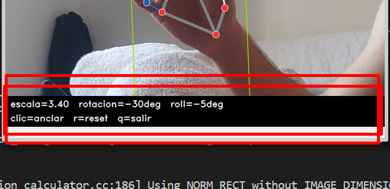

# Ej. 2 — Controlador Sin Contacto

!!! abstract "Enunciado"
    Haz un controlador sin contacto de varios grados de libertad que mida, al menos, distancia de la mano a la cámara y ángulo de orientación. Utilízalo para controlar alguno de tus programas.

---

## Parámetros clave { #parametros }

| Parámetro | Valor | Descripción |
|-----------|-------|-------------|
| `model_complexity` | 0 | Modelo lite de MediaPipe; prioriza velocidad sobre precisión |
| `min_detection_confidence` | 0.6 | Umbral mínimo para que MediaPipe confirme una detección nueva |
| `min_tracking_confidence` | 0.6 | Umbral mínimo para mantener el tracking entre frames |
| `_INFER_SCALE` | 0.5 | Factor de reducción del frame antes de pasar a MediaPipe |
| `_BBOX_FAR` | 0.10 | Diagonal del bounding box normalizado con la mano lejana |
| `_BBOX_CLOSE` | 0.55 | Diagonal del bounding box normalizado con la mano cerca |

!!! tip "Parámetro más sensible: `_BBOX_FAR` / `_BBOX_CLOSE`"
    Si la detección de distancia satura en 0 o en 1 con demasiada frecuencia, ajusta estos dos umbrales a la distancia real de trabajo con la cámara. `_BBOX_FAR` = diagonal típica cuando la mano está al fondo; `_BBOX_CLOSE` = diagonal típica cuando la mano está muy cerca.

---

## Grados de libertad { #gdl }

`HandController` extrae **4 grados de libertad** a partir de los 21 landmarks que MediaPipe estima en cada frame. El enunciado pide al menos distancia y ángulo; la implementación anade roll y posición XY de la palma para un control más completo.

<figure markdown>
  
  <figcaption>Los 21 landmarks de MediaPipe con los 4 GDL anotados: diagonal del bounding box (distancia), vector palma→dedo medio (yaw), diferencia de profundidad índice–menique (roll) y centroide de la palma (XY).</figcaption>
</figure>

### GDL 1 — Distancia (`distance ∈ [0, 1]`)

<figure markdown>
  
  <figcaption>Cuando la mano está lejos la diagonal del bounding box normalizado es ~0.10; al acercarse llega a ~0.55. La fórmula linealiza este rango a [0, 1].</figcaption>
</figure>

```python title="extra_8_7_2/hand_controller.py — distancia" linenums="1"
diag = float(np.linalg.norm(pts.max(0) - pts.min(0)))
dist = float(np.clip(
    (diag - self._BBOX_FAR) / (self._BBOX_CLOSE - self._BBOX_FAR),
    0.0, 1.0,
))   # _BBOX_FAR=0.10, _BBOX_CLOSE=0.55
```

Controla la **escala** del objeto AR (`_SCALE_MIN=0.3 … _SCALE_MAX=2.5`).

### GDL 2 — Ángulo de orientación / yaw (`angle_deg`)

<figure markdown>
  
  <figcaption>El ángulo se mide entre la muneca (landmark 0) y el nudillo del dedo corazón (landmark 9). Vertical hacia arriba = 0°; rotar la mano en el plano de la imagen varía el ángulo.</figcaption>
</figure>

```python title="extra_8_7_2/hand_controller.py — yaw" linenums="1"
dv        = pts[9] - pts[0]                          # muneca → nudillo medio
angle_deg = float(np.degrees(np.arctan2(dv[0], -dv[1])))
```

Controla la **rotación Y** del objeto AR.

### GDL 3 — Roll (`roll_deg ∈ [-80°, +80°]`)

```python title="extra_8_7_2/hand_controller.py — roll" linenums="1"
roll_deg = float(np.clip((z[5] - z[17]) * 500, -80, 80))
# z[5]=nudillo índice, z[17]=nudillo menique
```

La diferencia de coordenada Z (profundidad estimada por MediaPipe) entre el nudillo del índice (landmark 5) y el del menique (landmark 17) indica cuánto está girada la mano sobre el eje muneca-dedos. Controla la **rotación X** del objeto AR.

### GDL 4 — Posición XY de la palma (`norm_x, norm_y ∈ [0, 1]`)

```python title="extra_8_7_2/hand_controller.py — posición XY" linenums="1"
palm = pts[[0, 5, 9, 13, 17]].mean(0)   # centroide de los 5 puntos de palma
```

Controla el **offset de desplazamiento** del objeto respecto al ancla (±30 % del frame).

---

## Pipeline de inferencia { #pipeline }

```python title="extra_8_7_2/hand_controller.py — process()" linenums="1"
def process(self, frame_bgr: np.ndarray) -> HandState:
    sw = max(1, int(w * self._INFER_SCALE))     # _INFER_SCALE = 0.5
    sh = max(1, int(h * self._INFER_SCALE))
    rgb = cv.cvtColor(cv.resize(frame_bgr, (sw, sh)), cv.COLOR_BGR2RGB)
    res = self._detector.process(rgb)
    ...
```

MediaPipe se ejecuta sobre el frame reducido al 50 % para reducir la latencia. Las coordenadas de landmarks ya vienen normalizadas a [0, 1] por MediaPipe, por lo que el cambio de escala no afecta a los cálculos.

<figure markdown>
  
  <figcaption>HUD mostrando los 4 GDL en tiempo real: escala, rotación en grados, y estado de detección. Los landmarks de MediaPipe se dibujan sobre la mano.</figcaption>
</figure>

---

## Integración con run.py { #integracion }

`run.py` actúa como pegamento entre los tres ejercicios y es el único punto de entrada al sistema completo.

### Contrato de interfaz: `HandState`

`HandState` es el dataclass que desacopla el Ej. 2 del Ej. 7: `HandController.process()` lo produce y `ARViewer.update()` lo consume. Ningún módulo conoce los detalles internos del otro.

```python title="extra_8_7_2/hand_controller.py — HandState" linenums="1"
@dataclass
class HandState:
    detected:      bool   = False    # False si MediaPipe no detecta mano
    distance:      float  = 0.5     # GDL 1: distancia normalizada [0, 1]
    roll_deg:      float  = 0.0     # GDL 3: inclinación lateral [-80°, +80°]
    angle_deg:     float  = 0.0     # GDL 2: orientación de la mano (yaw)
    norm_x:        float  = 0.5     # GDL 4: posición X de la palma [0, 1]
    norm_y:        float  = 0.5     # GDL 4: posición Y de la palma [0, 1]
    landmarks_raw: object = None    # landmarks brutos de MediaPipe (solo para dibujo)
```

Cuando `detected=False`, `ARViewer.update()` retorna inmediatamente sin modificar ningún estado y el objeto queda congelado en su última posición.

### Bucle principal

```python title="extra_8_7_2/run.py — bucle principal" linenums="1"
for key, frame in stream:
    if key == ord("r"):
        ar.reset()

    state = hand.process(frame)      # Ej. 2: extraer 4 GDL
    ar.update(state, frame.shape)    # Ej. 7: actualizar posición/escala/rotación
    ar.draw(frame)                   # Ej. 7: renderizar wireframe
    hand.draw_landmarks(frame, state)

    cv.imshow(WIN, draw_hud(frame, ar.status(state)))
```

El argumento `--model` conecta el ejercicio 8 con el sistema AR: si se pasa la ruta al `.obj` descargado de Colab, el modelo reconstruido reemplaza al cubo de referencia.

```bash
# Flujo completo de los tres ejercicios:
python extra_8_7_2/run.py --model=vggt_model.obj
```

---

## Decisiones de diseno { #decisiones }

### Inferencia a media resolución

MediaPipe Hands se ejecuta sobre el frame reducido al 50 % (`_INFER_SCALE=0.5`). Las coordenadas de landmarks se normalizan internamente por MediaPipe, por lo que la reducción no afecta a los cálculos de GDL. El resultado es aproximadamente 4× menos píxeles procesados respecto a resolución completa.

### Bounding box como proxy de distancia

La distancia real de la mano a la cámara requeriría calibración de la cámara y conocimiento del tamano físico de la mano. El tamano del bounding box en coordenadas normalizadas es un proxy robusto y calibración-libre: siempre cae en el rango [0.10, 0.55] con independencia de la resolución del frame.

---

## Limitaciones { #limitaciones }

!!! warning "Limitaciones conocidas"
    - El **roll** estimado por la coordenada Z de MediaPipe es inherentemente ruidoso; incluso con `α=0.18` puede mostrar temblor en condiciones de iluminación variable.
    - Con luz de fondo (backlight) o mano parcialmente fuera del frame, MediaPipe pierde la detección y el objeto queda congelado en la última posición.
    - Solo se detecta **una mano** (`max_num_hands=1`); no hay soporte para control bimanual.
    - La escala de **distancia** asume una mano adulta a distancia típica de una webcam (~40-60 cm); en otras configuraciones, los umbrales `_BBOX_FAR` y `_BBOX_CLOSE` deben recalibrarse.
