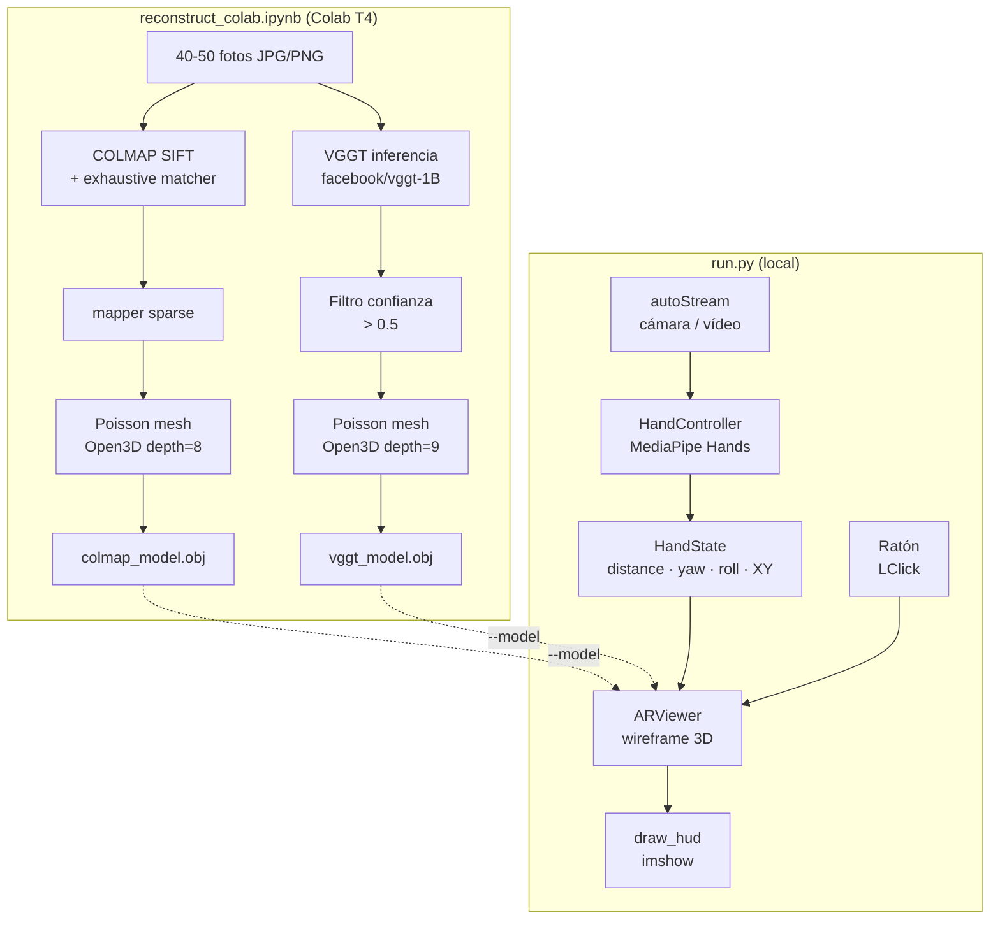
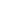

# Ejercicios Extra: Reconstrucción 3D, Realidad Aumentada y Control Gestual

## Descripción general

Esta sección documenta la resolución conjunta de **tres ejercicios opcionales** de la asignatura. Los tres comparten un hilo conductor: un objeto físico real es fotografiado y reconstruido en 3D, el modelo resultante se proyecta sobre la imagen de cámara como efecto de realidad aumentada, y todo el sistema se controla sin contacto mediante gestos de mano. El fichero de entrada de cada pieza es la salida de la anterior.

```
Fotos del objeto  →  reconstruct_colab.ipynb  →  modelo.obj
                                                       ↓
Cámara  →  hand_controller.py  →  HandState  →  ar_viewer.py  →  run.py
```

---

## Enunciados resueltos { #enunciados }

!!! abstract "Ejercicio 8"
    Utiliza [COLMAP](https://colmap.github.io/) o [Meshroom](https://meshroom-manual.readthedocs.io/en/latest/) para construir un modelo 3D de un objeto. Compara con [VGGT](https://github.com/facebookresearch/vggt).

!!! abstract "Ejercicio 7"
    Crea un efecto de realidad aumentada en el que el usuario desplace objetos virtuales hacia posiciones marcadas con el ratón.

!!! abstract "Ejercicio 2"
    Haz un controlador sin contacto de varios grados de libertad que mida, al menos, distancia de la mano a la cámara y ángulo de orientación. Utilízalo para controlar alguno de tus programas.

---

## Requisitos y ejecución { #requisitos }

!!! info "Entorno local"
    Python 3.10+, OpenCV 4.9, NumPy 1.26, MediaPipe 0.10, SciPy.

!!! info "Entorno Colab (solo ejercicio 8)"
    Google Colab con GPU T4. Instala COLMAP, Open3D y el paquete `vggt` en las primeras celdas del notebook.

### Paso 1 — Reconstruir el modelo 3D (Ejercicio 8)

Abre `extra_8_7_2/reconstruct_colab.ipynb` en Google Colab:

1. *Entorno de ejecución → Cambiar tipo → GPU T4*
2. *Entorno de ejecución → Ejecutar todo* (`Ctrl+F9`)
3. Cuando aparezca la celda de subida, selecciona **40-50 fotos** del objeto (JPG/PNG).
4. La última celda descarga automáticamente `colmap_model.obj` y `vggt_model.obj`.

### Paso 2 — Ejecutar el sistema AR con control gestual (Ejercicios 7 y 2)

```bash
# Con modelo 3D reconstruido:
python extra_8_7_2/run.py --model=vggt_model.obj

# Sin modelo (cubo de referencia):
python extra_8_7_2/run.py
```

| Acción | Descripción |
|--------|-------------|
| LClick sobre imagen | Anclar el objeto virtual en esa posición |
| Mover la mano | Desplazar, escalar y rotar el objeto en tiempo real |
| `r` | Resetear escala y rotación al estado inicial |
| `q` / Esc | Salir |

---

## Arquitectura global { #arquitectura }



<figure markdown>
  
  <figcaption>Sistema completo: modelo 3D reconstruido proyectado sobre la imagen de cámara y controlado por gestos de mano. El marcador amarillo indica el punto de anclaje fijado con el ratón.</figcaption>
</figure>

---

## Parámetros clave { #parametros }

### HandController (Ejercicio 2)

| Parámetro | Valor | Descripción |
|-----------|-------|-------------|
| `model_complexity` | 0 | Modelo lite de MediaPipe; prioriza velocidad sobre precisión |
| `min_detection_confidence` | 0.6 | Umbral mínimo para que MediaPipe confirme una detección nueva |
| `min_tracking_confidence` | 0.6 | Umbral mínimo para mantener el tracking entre frames |
| `_INFER_SCALE` | 0.5 | Factor de reducción del frame antes de pasar a MediaPipe |
| `_BBOX_FAR` | 0.10 | Diagonal del bounding box normalizado con la mano lejana |
| `_BBOX_CLOSE` | 0.55 | Diagonal del bounding box normalizado con la mano cerca |

!!! tip "Parámetro más sensible: `_BBOX_FAR` / `_BBOX_CLOSE`"
    Si la detección de distancia satura en 0 o en 1 con demasiada frecuencia, ajusta estos dos umbrales a la distancia real de trabajo con la cámara. `_BBOX_FAR` = diagonal típica cuando la mano está al fondo; `_BBOX_CLOSE` = diagonal típica cuando la mano está muy cerca.

### ARViewer (Ejercicio 7)

| Parámetro | Valor | Descripción |
|-----------|-------|-------------|
| `_BASE_PX` | 80 px | Radio base del objeto en píxeles a escala 1.0 |
| `_SCALE_MIN` | 0.3 | Escala mínima del objeto AR (mano lejana) |
| `_SCALE_MAX` | 2.5 | Escala máxima del objeto AR (mano cerca) |
| `_XY_FRAC` | 0.60 | Fracción del ancho/alto del frame para el offset XY de palma |
| `_SMOOTH` | 0.25 | Coeficiente α del filtro exponencial (escala, yaw, XY) |
| `_SMOOTH_RY` | 0.18 | Coeficiente α del filtro exponencial para roll (más conservador) |
| `max_edges` | 4 000 | Límite de aristas al cargar un modelo `.obj` denso |

### Notebook COLMAP / VGGT (Ejercicio 8)

| Parámetro | Valor | Descripción |
|-----------|-------|-------------|
| `CONF_THRESH` | 0.5 | Umbral de confianza de VGGT para filtrar puntos ruidosos |
| `MAX_PTS` | 400 000 | Máximo de puntos antes de Poisson (evita OOM en T4) |
| Poisson `depth` COLMAP | 8 | Resolución del árbol octante (nube sparse) |
| Poisson `depth` VGGT | 9 | Resolución del árbol octante (nube densa) |
| Density quantile COLMAP | 0.15 | Corte inferior de densidad Poisson (elimina artefactos de borde) |
| Density quantile VGGT | 0.10 | Corte inferior de densidad Poisson |
| `std_ratio` (outlier removal) | 2.0 | Umbral estadístico para eliminar puntos aislados |

!!! tip "Parámetro más sensible: `CONF_THRESH`"
    Bajar `CONF_THRESH` de 0.5 a 0.3 incluye más puntos pero añade ruido de fondo. Subirlo a 0.7 da nubes más limpias pero puede dejar huecos en zonas de baja confianza (bordes, reflejos).

---

## Ejercicio 8 — Reconstrucción 3D: COLMAP vs VGGT { #ej8 }

### Flujo de trabajo en Colab

<figure markdown>
  
  <figcaption>Celda de subida de imágenes en Google Colab. Se recomienda entre 40 y 50 fotos con solapamiento mínimo del 60 % entre vistas consecutivas.</figcaption>
</figure>

!!! tip "Cómo fotografiar el objeto"
    - Dar una vuelta completa al objeto en pasos de ~10°, manteniendo distancia constante.
    - Incluir vistas desde arriba (45°) y desde abajo (45°) para cubrir los polos.
    - Fondo neutro y uniforme. Evitar superficies completamente lisas y reflectantes (COLMAP necesita textura para detectar keypoints SIFT).
    - Mínimo de 5 fotos, recomendado 40-50 para Poisson de calidad.

### Pipeline COLMAP

<figure markdown>
  
  <figcaption>Nube de puntos sparse de COLMAP tras el mapper. Los colores corresponden a los valores RGB de cada punto 3D triangulado.</figcaption>
</figure>

```python title="reconstruct_colab.ipynb — COLMAP feature extraction + mapper" linenums="1"
subprocess.run(['colmap', 'feature_extractor',
    '--database_path', DB, '--image_path', str(IMG_DIR),
    '--ImageReader.single_camera', '1',
    '--SiftExtraction.use_gpu', '0'], check=True)

subprocess.run(['colmap', 'exhaustive_matcher',
    '--database_path', DB,
    '--SiftMatching.use_gpu', '0'], check=True)

subprocess.run(['colmap', 'mapper',
    '--database_path', DB, '--image_path', str(IMG_DIR),
    '--output_path', 'sparse'], check=True)
```

La reconstrucción densa (`patch_match_stereo`) está desactivada porque el binario de COLMAP de `apt` en Colab no tiene soporte CUDA. Se usa reconstrucción **sparse** seguida de malla Poisson con `depth=8`.

### Pipeline VGGT

<figure markdown>
  
  <figcaption>Nube de puntos densa de VGGT tras filtrar por confianza > 0.5. VGGT produce geometría incluso en zonas sin textura donde COLMAP no triangula puntos.</figcaption>
</figure>

```python title="reconstruct_colab.ipynb — VGGT inferencia + filtro de confianza" linenums="1"
model  = VGGT.from_pretrained('facebook/vggt-1B').to(device).eval()
frames = load_and_preprocess_images([str(p) for p in imgs]).to(device)

with torch.no_grad():
    preds = model(frames.unsqueeze(0))

world_pts  = preds['world_points'][0].cpu().float().numpy()
world_conf = preds['world_points_conf'][0].cpu().float().numpy()

# Filtrar puntos con baja confianza y submuestrear a 400 k
mask  = world_conf > CONF_THRESH          # CONF_THRESH = 0.5
pts_v = world_pts[mask].reshape(-1, 3)
```

### Malla Poisson (común a ambos)

```python title="reconstruct_colab.ipynb — Poisson reconstruction con Open3D" linenums="1"
pcd.remove_statistical_outlier(nb_neighbors=20, std_ratio=2.0)
pcd.estimate_normals(o3d.geometry.KDTreeSearchParamHybrid(radius=0.05, max_nn=30))
pcd.orient_normals_consistent_tangent_plane(30)

mesh, dens = o3d.geometry.TriangleMesh.create_from_point_cloud_poisson(pcd, depth=depth)
mesh.remove_vertices_by_mask(np.asarray(dens) < np.quantile(np.asarray(dens), 0.15))
mesh = mesh.filter_smooth_simple(5)
o3d.io.write_triangle_mesh('colmap_model.obj', mesh)
```

### Comparativa COLMAP vs VGGT

<figure markdown>
  
  <figcaption>Vista 3D comparativa generada por el notebook: nube COLMAP (izq.) vs nube VGGT (dcha.). El colormap viridis codifica profundidad.</figcaption>
</figure>

| Métrica | COLMAP | VGGT |
|---------|--------|------|
| Tiempo total en T4 (s) | — | — |
| Tiempo extracción + matching (s) | — | — |
| Tiempo inferencia / mapper (s) | — | — |
| Tiempo Poisson (s) | — | — |
| Cámaras registradas / total | — / — | — / — |
| Puntos 3D tras filtrado | — | — |
| Triángulos en malla final | — | — |
| Reconstrucción densa | No (sparse + Poisson) | Siempre |

!!! warning "Tabla pendiente de rellenar"
    Ejecutar `reconstruct_colab.ipynb` en Colab T4 con el objeto definitivo e introducir aquí los valores impresos por la celda de comparativa.

<figure markdown>
  
  <figcaption>Visualización interactiva Plotly del notebook: ambas mallas superpuestas con opacidad 0.6. Permite inspeccionar la completitud y el nivel de detalle de cada reconstrucción.</figcaption>
</figure>

---

## Ejercicio 7 — Realidad Aumentada Gestual { #ej7 }

### Carga del modelo y fallback

`ARViewer` admite un fichero `.obj` generado por COLMAP o VGGT; si no se especifica `--model` o el fichero no existe, usa un **cubo unitario de referencia** para que el sistema sea ejecutable en cualquier momento.

El `load_obj` maneja dos casos:

- **Mallas con caras** (`.obj` con líneas `f`): extrae aristas únicas de cada polígono.
- **Nubes de puntos sin caras** (salida típica de COLMAP/VGGT exportada directamente): computa el `ConvexHull` de los vértices para derivar aristas y mostrar la envolvente del objeto.

```python title="extra_8_7_2/ar_viewer.py — load_obj() gestión de nube de puntos" linenums="1"
if not edges:
    from scipy.spatial import ConvexHull
    hull = ConvexHull(arr)
    for simplex in hull.simplices:
        for k in range(len(simplex)):
            a, b = int(simplex[k]), int(simplex[(k + 1) % len(simplex)])
            edges.add((min(a, b), max(a, b)))
```

### Anclaje con ratón y desplazamiento gestual

<figure markdown>
  
  <figcaption>Cubo de referencia proyectado sobre la imagen con el marcador de anclaje (cruz amarilla). Un clic izquierdo mueve el ancla a cualquier posición de la imagen.</figcaption>
</figure>

<figure markdown>
  
  <figcaption>Modelo 3D reconstruido cargado en el visor AR. La mano (visible en la esquina) controla la escala y rotación en tiempo real.</figcaption>
</figure>

El objeto se renderiza en `cx = anchor_x + ox`, `cy = anchor_y + oy`, donde `ox` y `oy` son offsets continuos derivados de la posición normalizada de la palma:

```python title="extra_8_7_2/ar_viewer.py — update()" linenums="1"
target_ox = (state.norm_x - 0.5) * w * self._XY_FRAC   # _XY_FRAC = 0.60
target_oy = (state.norm_y - 0.5) * h * self._XY_FRAC
```

Cuando la palma está centrada en el frame (`norm_x = norm_y = 0.5`), el offset es cero y el objeto queda exactamente sobre el ancla. Desplazando la palma se puede arrastrar el objeto hasta ±30 % del ancho/alto del frame a partir del ancla.

<figure markdown>
  
  <figcaption>Secuencia: clic sobre una nueva posición y el objeto salta al ancla marcada. La mano retoma el control de offset y rotación desde ese punto.</figcaption>
</figure>

### Renderizado en perspectiva simplificada

El visor aplica rotaciones `Ry(ry) @ Rx(rx)` sobre los vértices y proyecta solo los dos primeros componentes al plano de imagen (proyección ortográfica). La profundidad del eje Z se usa únicamente para modular el color de cada arista:

```python title="extra_8_7_2/ar_viewer.py — draw()" linenums="1"
for i, j in self._edges:
    z = float(rot[i, 2] + rot[j, 2]) * 0.5
    g = int(np.clip((z + 1) * 0.5 * 155 + 100, 100, 255))
    cv.line(frame, tuple(ipts[i]), tuple(ipts[j]), (0, g, 255 - g // 2), 2, cv.LINE_AA)
```

Las aristas más alejadas de la cámara (z pequeño) son azul intenso; las más cercanas (z grande) viran al verde.

---

## Ejercicio 2 — Controlador Sin Contacto { #ej2 }

### Grados de libertad

`HandController` extrae **4 grados de libertad** a partir de los 21 landmarks que MediaPipe estima en cada frame. El enunciado pide al menos distancia y ángulo; la implementación añade roll y posición XY de la palma para un control más completo.

<figure markdown>
  
  <figcaption>Los 21 landmarks de MediaPipe con los 4 GDL anotados: diagonal del bounding box (distancia), vector palma→dedo medio (yaw), diferencia de profundidad índice–meñique (roll) y centroide de la palma (XY).</figcaption>
</figure>

#### GDL 1 — Distancia (`distance ∈ [0, 1]`)

<figure markdown>
  
  <figcaption>Cuando la mano está lejos la diagonal del bounding box normalizado es ~0.10; al acercarse llega a ~0.55. La fórmula linealiza este rango a [0, 1].</figcaption>
</figure>

```python title="extra_8_7_2/hand_controller.py — distancia" linenums="1"
diag = float(np.linalg.norm(pts.max(0) - pts.min(0)))
dist = float(np.clip(
    (diag - self._BBOX_FAR) / (self._BBOX_CLOSE - self._BBOX_FAR),
    0.0, 1.0,
))   # _BBOX_FAR=0.10, _BBOX_CLOSE=0.55
```

Controla la **escala** del objeto AR (`_SCALE_MIN=0.3 … _SCALE_MAX=2.5`).

#### GDL 2 — Ángulo de orientación / yaw (`angle_deg`)

<figure markdown>
  
  <figcaption>El ángulo se mide entre la muñeca (landmark 0) y el nudillo del dedo corazón (landmark 9). Vertical hacia arriba = 0°; rotar la mano en el plano de la imagen varía el ángulo.</figcaption>
</figure>

```python title="extra_8_7_2/hand_controller.py — yaw" linenums="1"
dv        = pts[9] - pts[0]                          # muñeca → nudillo medio
angle_deg = float(np.degrees(np.arctan2(dv[0], -dv[1])))
```

Controla la **rotación Y** del objeto AR.

#### GDL 3 — Roll (`roll_deg ∈ [-80°, +80°]`)

```python title="extra_8_7_2/hand_controller.py — roll" linenums="1"
roll_deg = float(np.clip((z[5] - z[17]) * 500, -80, 80))
# z[5]=nudillo índice, z[17]=nudillo meñique
```

La diferencia de coordenada Z (profundidad estimada por MediaPipe) entre el nudillo del índice (landmark 5) y el del meñique (landmark 17) indica cuánto está girada la mano sobre el eje muñeca-dedos. Controla la **rotación X** del objeto AR.

#### GDL 4 — Posición XY de la palma (`norm_x, norm_y ∈ [0, 1]`)

```python title="extra_8_7_2/hand_controller.py — posición XY" linenums="1"
palm = pts[[0, 5, 9, 13, 17]].mean(0)   # centroide de los 5 puntos de palma
```

Controla el **offset de desplazamiento** del objeto respecto al ancla (±30 % del frame).

### Pipeline de inferencia

```python title="extra_8_7_2/hand_controller.py — process()" linenums="1"
def process(self, frame_bgr: np.ndarray) -> HandState:
    sw = max(1, int(w * self._INFER_SCALE))     # _INFER_SCALE = 0.5
    sh = max(1, int(h * self._INFER_SCALE))
    rgb = cv.cvtColor(cv.resize(frame_bgr, (sw, sh)), cv.COLOR_BGR2RGB)
    res = self._detector.process(rgb)
    ...
```

MediaPipe se ejecuta sobre el frame reducido al 50 % para reducir la latencia. Las coordenadas de landmarks ya vienen normalizadas a [0, 1] por MediaPipe, por lo que el cambio de escala no afecta a los cálculos.

<figure markdown>
  
  <figcaption>HUD mostrando los 4 GDL en tiempo real: escala, rotación en grados, y estado de detección. Los landmarks de MediaPipe se dibujan sobre la mano.</figcaption>
</figure>

---

## Integración: run.py { #integracion }

`run.py` actúa como pegamento entre los tres ejercicios. Es el único punto de entrada al sistema completo:

### Contrato de interfaz: `HandState`

`HandState` es el dataclass que desacopla el Ej. 2 del Ej. 7: `HandController.process()` lo produce y `ARViewer.update()` lo consume. Ningún módulo conoce los detalles internos del otro.

```python title="extra_8_7_2/hand_controller.py — HandState" linenums="1"
@dataclass
class HandState:
    detected:      bool   = False    # False si MediaPipe no detecta mano
    distance:      float  = 0.5     # GDL 1: distancia normalizada [0, 1]
    roll_deg:      float  = 0.0     # GDL 3: inclinación lateral [-80°, +80°]
    angle_deg:     float  = 0.0     # GDL 2: orientación de la mano (yaw)
    norm_x:        float  = 0.5     # GDL 4: posición X de la palma [0, 1]
    norm_y:        float  = 0.5     # GDL 4: posición Y de la palma [0, 1]
    landmarks_raw: object = None    # landmarks brutos de MediaPipe (solo para dibujo)
```

Cuando `detected=False`, `ARViewer.update()` retorna inmediatamente sin modificar ningún estado y el objeto queda congelado en su última posición.

### Bucle principal

```python title="extra_8_7_2/run.py — bucle principal" linenums="1"
for key, frame in stream:
    if key == ord("r"):
        ar.reset()

    state = hand.process(frame)      # Ej. 2: extraer 4 GDL
    ar.update(state, frame.shape)    # Ej. 7: actualizar posición/escala/rotación
    ar.draw(frame)                   # Ej. 7: renderizar wireframe
    hand.draw_landmarks(frame, state)

    cv.imshow(WIN, draw_hud(frame, ar.status(state)))
```

El argumento `--model` conecta el ejercicio 8 con el sistema AR: si se pasa la ruta al `.obj` descargado de Colab, el modelo reconstruido reemplaza al cubo de referencia.

```bash
# Flujo completo de los tres ejercicios:
python extra_8_7_2/run.py --model=vggt_model.obj
```

---

## Decisiones de diseño { #decisiones }

### Ej. 8 — COLMAP sin reconstrucción densa

El binario de COLMAP disponible en `apt` de Colab no tiene CUDA habilitado en `patch_match_stereo`. En lugar de forzar una compilación desde fuente (que añadiría 20-30 min al proceso), se usa la nube sparse como entrada a Poisson, obteniendo una malla cerrada con calidad suficiente para visualización.

### Ej. 8 — VGGT con umbral de confianza adaptable

VGGT devuelve `world_points_conf` para cada punto. Usar `conf > 0.5` descarta puntos en zonas de fondo y oclusiones donde el modelo no está seguro, reduciendo el ruido en la malla final. El subsampling a 400 k puntos evita OOM al construir la malla Poisson en GPU T4.

### Ej. 7 — Separación ancla / offset

El ratón fija el centro del objeto (ancla) y la mano solo aplica un offset relativo. Esto permite anclar el objeto sobre un elemento de la escena con precisión y luego moverlo con la mano sin tener que mantener la palma exactamente en ese punto.

### Ej. 7 — Suavizado exponencial asimétrico

Se usan dos valores de `α` distintos: `0.25` para escala, yaw y XY (respuesta ágil), y `0.18` para roll (más suave). El roll se estima a partir de la coordenada Z de MediaPipe, que es más ruidosa que la posición XY, por lo que necesita un filtro más conservador para evitar temblores visibles.

### Ej. 2 — Inferencia a media resolución

MediaPipe Hands se ejecuta sobre el frame reducido al 50 % (`_INFER_SCALE=0.5`). Las coordenadas de landmarks se normalizan internamente por MediaPipe, por lo que la reducción no afecta a los cálculos de GDL. El resultado es aproximadamente 4× menos píxeles procesados respecto a resolución completa.

### Ej. 2 — Bounding box como proxy de distancia

La distancia real de la mano a la cámara requeriría calibración de la cámara y conocimiento del tamaño físico de la mano. El tamaño del bounding box en coordenadas normalizadas es un proxy robusto y calibración-libre: siempre cae en el rango [0.10, 0.55] con independencia de la resolución del frame.

---

## Limitaciones { #limitaciones }

!!! warning "Ejercicio 8 — Reconstrucción"
    - COLMAP falla con objetos de **superficies lisas o poco texturadas** (no se detectan suficientes keypoints SIFT). VGGT es más robusto en estos casos al no depender de matches locales.
    - La malla Poisson a partir de nube **sparse** de COLMAP puede tener agujeros en zonas con pocos puntos.
    - VGGT puede dar OOM en T4 con más de ~40 imágenes de alta resolución; se recomienda redimensionar a 1024 px máximo antes de subir.
    - Los `.obj` exportados por Open3D no incluyen texturas; el modelo AR es solo geometría (wireframe).

!!! warning "Ejercicio 7 — Realidad aumentada"
    - La proyección es **ortográfica**, no perspectiva: no hay corrección por posición de cámara ni escala dependiente de la profundidad. El efecto AR no es fotorrealista.
    - Con modelos complejos (muchos vértices), el `ConvexHull` para nubes sin caras puede ser muy lento o producir geometría incorrecta.
    - El límite de `max_edges=4000` puede simplificar en exceso modelos densos, perdiendo detalle geométrico.

!!! warning "Ejercicio 2 — Controlador de mano"
    - El **roll** estimado por la coordenada Z de MediaPipe es inherentemente ruidoso; incluso con `α=0.18` puede mostrar temblor en condiciones de iluminación variable.
    - Con luz de fondo (backlight) o mano parcialmente fuera del frame, MediaPipe pierde la detección y el objeto queda congelado en la última posición.
    - Solo se detecta **una mano** (`max_num_hands=1`); no hay soporte para control bimanual.
    - La escala de **distancia** asume una mano adulta a distancia típica de una webcam (~40-60 cm); en otras configuraciones, los umbrales `_BBOX_FAR` y `_BBOX_CLOSE` deben recalibrarse.
