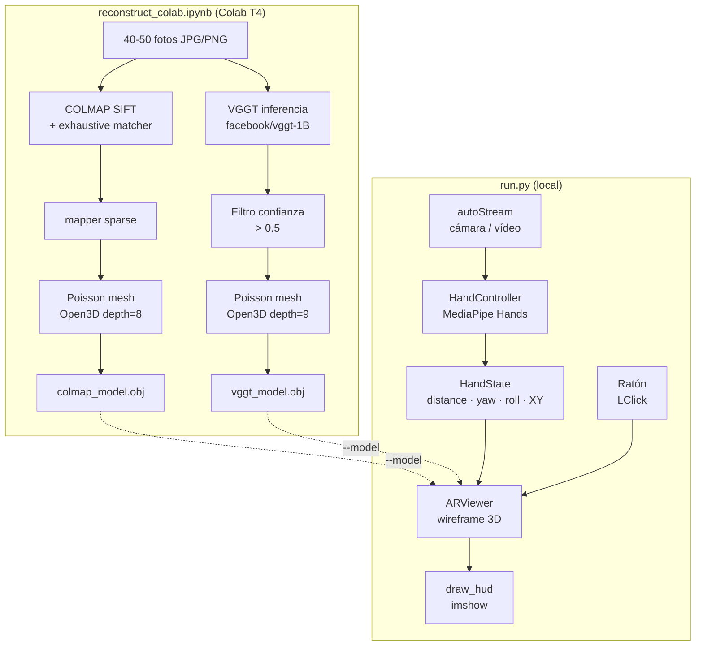

# Ejercicios Extra: Reconstrucción 3D, Realidad Aumentada y Control Gestual

## Descripción general

Esta sección documenta la resolución conjunta de **tres ejercicios opcionales** de la asignatura. Los tres comparten un hilo conductor: un objeto físico real es fotografiado y reconstruido en 3D, el modelo resultante se proyecta sobre la imagen de cámara como efecto de realidad aumentada, y todo el sistema se controla sin contacto mediante gestos de mano. El fichero de entrada de cada pieza es la salida de la anterior.

```
Fotos del objeto  →  reconstruct_colab.ipynb  →  modelo.obj
                                                       ↓
Cámara  →  hand_controller.py  →  HandState  →  ar_viewer.py  →  run.py
```

---

## Enunciados resueltos { #enunciados }

!!! abstract "Ejercicio 8"
    Utiliza [COLMAP](https://colmap.github.io/) o [Meshroom](https://meshroom-manual.readthedocs.io/en/latest/) para construir un modelo 3D de un objeto. Compara con [VGGT](https://github.com/facebookresearch/vggt).

!!! abstract "Ejercicio 7"
    Crea un efecto de realidad aumentada en el que el usuario desplace objetos virtuales hacia posiciones marcadas con el ratón.

!!! abstract "Ejercicio 2"
    Haz un controlador sin contacto de varios grados de libertad que mida, al menos, distancia de la mano a la cámara y ángulo de orientación. Utilízalo para controlar alguno de tus programas.

---

## Requisitos y ejecución { #requisitos }

!!! info "Entorno local"
    Python 3.10+, OpenCV 4.9, NumPy 1.26, MediaPipe 0.10, SciPy.

!!! info "Entorno Colab (solo ejercicio 8)"
    Google Colab con GPU T4. Instala COLMAP, Open3D y el paquete `vggt` en las primeras celdas del notebook.

### Paso 1 — Reconstruir el modelo 3D (Ejercicio 8)

Abre `extra_8_7_2/reconstruct_colab.ipynb` en Google Colab:

1. *Entorno de ejecución → Cambiar tipo → GPU T4*
2. *Entorno de ejecución → Ejecutar todo* (`Ctrl+F9`)
3. Cuando aparezca la celda de subida, selecciona **40-50 fotos** del objeto (JPG/PNG).
4. La última celda descarga automáticamente `colmap_model.obj` y `vggt_model.obj`.

### Paso 2 — Ejecutar el sistema AR con control gestual (Ejercicios 7 y 2)

```bash
# Con modelo 3D reconstruido:
python extra_8_7_2/run.py --model=vggt_model.obj

# Sin modelo (cubo de referencia):
python extra_8_7_2/run.py
```

| Acción | Descripción |
|--------|-------------|
| LClick sobre imagen | Anclar el objeto virtual en esa posición |
| Mover la mano | Desplazar, escalar y rotar el objeto en tiempo real |
| `r` | Resetear escala y rotación al estado inicial |
| `q` / Esc | Salir |

---

## Arquitectura global { #arquitectura }



<figure markdown>
  
  <figcaption>Sistema completo: modelo 3D reconstruido proyectado sobre la imagen de cámara y controlado por gestos de mano. El marcador amarillo indica el punto de anclaje fijado con el ratón.</figcaption>
</figure>
