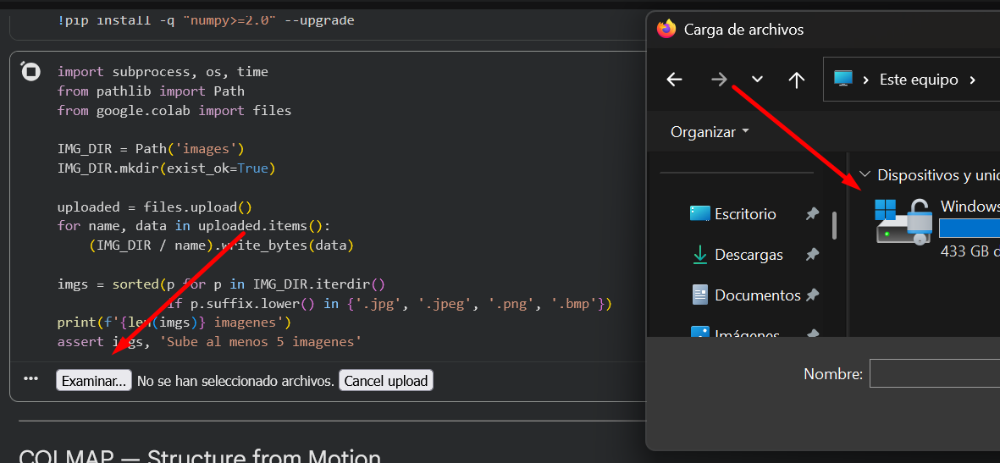
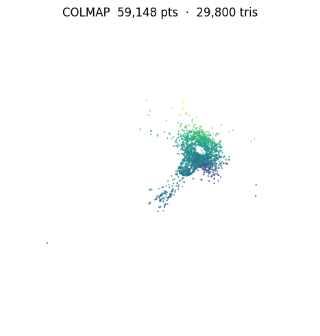
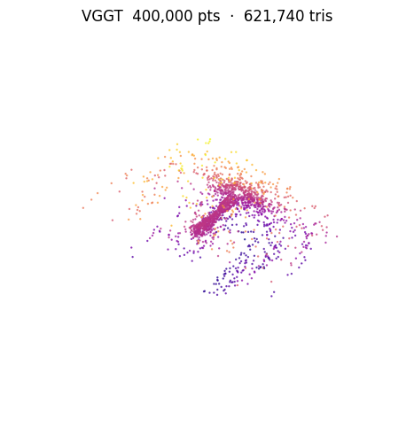
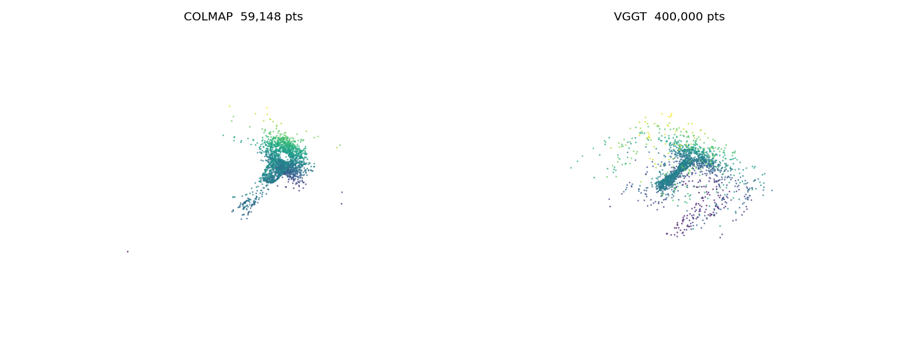

  # Ej. 8 — Reconstrucción 3D: COLMAP vs VGGT

  !!! abstract "Enunciado"
      Utiliza [COLMAP](https://colmap.github.io/) o [Meshroom](https://meshroom-manual.readthedocs.io/en/latest/) para construir un modelo 3D de un objeto. Compara con [VGGT](https://github.com/facebookresearch/vggt).

  ---

  ## Parámetros clave { #parametros }

  | Parámetro | Valor | Descripción |
  |-----------|-------|-------------|
  | `CONF_THRESH` | 0.5 | Umbral de confianza de VGGT para filtrar puntos ruidosos |
  | `MAX_PTS` | 400 000 | Máximo de puntos antes de Poisson (evita OOM en T4) |
  | Poisson `depth` COLMAP | 8 | Resolución del árbol octante (nube sparse) |
  | Poisson `depth` VGGT | 9 | Resolución del árbol octante (nube densa) |
  | Density quantile COLMAP | 0.15 | Corte inferior de densidad Poisson (elimina artefactos de borde) |
  | Density quantile VGGT | 0.10 | Corte inferior de densidad Poisson |
  | `std_ratio` (outlier removal) | 2.0 | Umbral estadístico para eliminar puntos aislados |

  !!! tip "Parámetro más sensible: `CONF_THRESH`"
      Bajar `CONF_THRESH` de 0.5 a 0.3 incluye más puntos pero anade ruido de fondo. Subirlo a 0.7 da nubes más limpias pero puede dejar huecos en zonas de baja confianza (bordes, reflejos).

  ---

  ## Flujo de trabajo en Colab { #flujo }

  <figure markdown>
    
    <figcaption>Celda de subida de imágenes en Google Colab. Se recomienda entre 40 y 50 fotos con solapamiento mínimo del 60 % entre vistas consecutivas.</figcaption>
  </figure>

  ### Objeto elegido: piña tropical

  Se eligió una piña como objeto de estudio por su textura superficial rica y heterogénea (escamas, corona), que en principio favorece la detección de keypoints SIFT. Se capturaron **64 imágenes**: aproximadamente la mitad a media altura rodeando el objeto en pasos de ~10°, y la otra mitad en picado (~45°) para cubrir la corona y los polos superiores.

  <div style="display:flex; gap:8px; margin:1em 0;">
    <figure style="flex:1; margin:0;">
      
      <figcaption style="font-size:.85em; text-align:center;">Vista lateral (media altura)</figcaption>
    </figure>
    <figure style="flex:1; margin:0;">
      
      <figcaption style="font-size:.85em; text-align:center;">Vista en picado (45°)</figcaption>
    </figure>
  </div>

  !!! tip "Cómo fotografiar el objeto"
      - Dar una vuelta completa al objeto en pasos de ~10°, manteniendo distancia constante.
      - Incluir vistas desde arriba (45°) y desde abajo (45°) para cubrir los polos.
      - Fondo neutro y uniforme. Evitar superficies completamente lisas y reflectantes (COLMAP necesita textura para detectar keypoints SIFT).
      - Mínimo de 5 fotos, recomendado 40-50 para Poisson de calidad.

  ---

  ## Pipeline COLMAP { #colmap }

  <figure markdown>
    
    <figcaption>Nube de puntos sparse de COLMAP tras el mapper. Los colores corresponden a los valores RGB de cada punto 3D triangulado.</figcaption>
  </figure>

  ```python title="reconstruct_colab.ipynb — COLMAP feature extraction + mapper" linenums="1"
  subprocess.run(['colmap', 'feature_extractor',
      '--database_path', DB, '--image_path', str(IMG_DIR),
      '--ImageReader.single_camera', '1',
      '--SiftExtraction.use_gpu', '0'], check=True)

  subprocess.run(['colmap', 'exhaustive_matcher',
      '--database_path', DB,
      '--SiftMatching.use_gpu', '0'], check=True)

  subprocess.run(['colmap', 'mapper',
      '--database_path', DB, '--image_path', str(IMG_DIR),
      '--output_path', 'sparse'], check=True)
  ```

  La reconstrucción densa (`patch_match_stereo`) está desactivada porque el binario de COLMAP de `apt` en Colab no tiene soporte CUDA. Se usa reconstrucción **sparse** seguida de malla Poisson con `depth=8`.

  ---

  ## Pipeline VGGT { #vggt }

  <figure markdown>
    
    <figcaption>Nube de puntos densa de VGGT tras filtrar por confianza > 0.5. VGGT produce geometría incluso en zonas sin textura donde COLMAP no triangula puntos.</figcaption>
  </figure>

  ```python title="reconstruct_colab.ipynb — VGGT inferencia + filtro de confianza" linenums="1"
  model  = VGGT.from_pretrained('facebook/vggt-1B').to(device).eval()
  frames = load_and_preprocess_images([str(p) for p in imgs]).to(device)

  with torch.no_grad():
      preds = model(frames.unsqueeze(0))

  world_pts  = preds['world_points'][0].cpu().float().numpy()
  world_conf = preds['world_points_conf'][0].cpu().float().numpy()

  # Filtrar puntos con baja confianza y submuestrear a 400 k
  mask  = world_conf > CONF_THRESH          # CONF_THRESH = 0.5
  pts_v = world_pts[mask].reshape(-1, 3)
  ```

  ---

  ## Malla Poisson (común a ambos) { #poisson }

  ```python title="reconstruct_colab.ipynb — Poisson reconstruction con Open3D" linenums="1"
  pcd.remove_statistical_outlier(nb_neighbors=20, std_ratio=2.0)
  pcd.estimate_normals(o3d.geometry.KDTreeSearchParamHybrid(radius=0.05, max_nn=30))
  pcd.orient_normals_consistent_tangent_plane(30)

  mesh, dens = o3d.geometry.TriangleMesh.create_from_point_cloud_poisson(pcd, depth=depth)
  mesh.remove_vertices_by_mask(np.asarray(dens) < np.quantile(np.asarray(dens), 0.15))
  mesh = mesh.filter_smooth_simple(5)
  o3d.io.write_triangle_mesh('colmap_model.obj', mesh)
  ```

  ---

  ## Comparativa COLMAP vs VGGT { #comparativa }

  <figure markdown>
    
    <figcaption>Vista 3D comparativa generada por el notebook: nube COLMAP (izq.) vs nube VGGT (dcha.). El colormap viridis codifica profundidad.</figcaption>
  </figure>

  | Métrica | COLMAP | VGGT |
  |---------|--------|------|
  | Tiempo total en T4 (s) | 3 704 | 407 |
  | Tiempo extracción + matching (s) | 3 354 | — |
  | Tiempo carga de modelo (s) | — | 208 |
  | Tiempo inferencia / mapper (s) | 349 | 388 |
  | Tiempo Poisson (s) | 2 | 19 |
  | Cámaras registradas / total | 1 / 64 | 64 / 64 |
  | Puntos 3D tras filtrado | 59 148 | 400 000 (submuestreado de 17 172 736) |
  | Triángulos en malla final | 29 800 | 621 740 |
  | Reconstrucción densa | No (sparse + Poisson) | Siempre |

  ---

  ## Objetos descartados: proceso de ensayo y error { #ensayo-error }

  Antes de llegar a la piña se probaron varios objetos. Cada intento reveló una limitación distinta del pipeline, y el proceso de descarte fue tan informativo como el resultado final.

  <div style="display:flex; gap:8px; margin:1em 0; flex-wrap:wrap;">
    <figure style="flex:1; min-width:140px; margin:0;">
      
      <figcaption style="font-size:.8em; text-align:center;"><strong>Molino de viento</strong></figcaption>
    </figure>
    <figure style="flex:1; min-width:140px; margin:0;">
      
      <figcaption style="font-size:.8em; text-align:center;"><strong>Peluche</strong></figcaption>
    </figure>
    <figure style="flex:1; min-width:140px; margin:0;">
      
      <figcaption style="font-size:.8em; text-align:center;"><strong>Uvas</strong></figcaption>
    </figure>
    <figure style="flex:1; min-width:140px; margin:0;">
      
      <figcaption style="font-size:.8em; text-align:center;"><strong>Piña ✓</strong></figcaption>
    </figure>
  </div>

  **Molino de viento** — La superficie blanca y sin textura de las aspas impide a SIFT detectar keypoints estables. Además, las aspas son demasiado delgadas para producir una nube de puntos coherente; COLMAP fallaba al emparejar vistas consecutivas porque no encontraba suficientes correspondencias.

  **Peluche** — El pelaje presenta colores muy homogéneos y repetitivos (sin puntos de anclaje únicos), y la sesión se realizó sobre un fondo completamente blanco que eliminó cualquier referencia de contexto adicional. Las patas finas sufrieron el mismo problema que las aspas del molino: demasiado estrechas para ser trianguladas.

  **Racimo de uvas** — La textura esférica de cada uva parecía ideal, pero su superficie brillante generaba especularidades que confundían al matcher. El problema se agravó porque el racimo se apoyaba sobre una mesa de cristal (otra fuente masiva de reflejos) y sobre un folio escrito, que resultó tener más textura visible para SIFT que la propia fruta.

  **Piña (objeto final)** — La textura regular pero heterogénea de las escamas, combinada con la silueta inconfundible de la corona, proporciona suficientes keypoints estables. Es el objeto que mejor equilibra textura, opacidad y geometría manejable dentro de las limitaciones del entorno Colab.

  ---

  ## Decisiones de diseño { #decisiones }

  ### COLMAP sin reconstrucción densa

  El binario de COLMAP disponible en `apt` de Colab no tiene CUDA habilitado en `patch_match_stereo`. En lugar de forzar una compilación desde fuente (que anadiría 20-30 min al proceso), se usa la nube sparse como entrada a Poisson, obteniendo una malla cerrada con calidad suficiente para visualización.

  ### VGGT con umbral de confianza adaptable

  VGGT devuelve `world_points_conf` para cada punto. Usar `conf > 0.5` descarta puntos en zonas de fondo y oclusiones donde el modelo no está seguro, reduciendo el ruido en la malla final. El subsampling a 400 k puntos evita OOM al construir la malla Poisson en GPU T4.

  ---

  ## Limitaciones { #limitaciones }

  !!! warning "Limitaciones conocidas"
      - COLMAP falla con objetos de **superficies lisas o poco texturadas** (no se detectan suficientes keypoints SIFT). VGGT es más robusto en estos casos al no depender de matches locales.
      - La malla Poisson a partir de nube **sparse** de COLMAP puede tener agujeros en zonas con pocos puntos.
      - VGGT puede dar OOM en T4 con más de ~40 imágenes de alta resolución; se recomienda redimensionar a 1024 px máximo antes de subir.
      - Los `.obj` exportados por Open3D no incluyen texturas; el modelo AR es solo geometría (wireframe).
