# Rectificación de Perspectiva

## Descripción

`rectificacion/rectificacion.py` permite **medir distancias reales en imágenes estáticas** tomadas desde cualquier ángulo. El usuario marca 4 o más puntos de referencia con coordenadas reales conocidas; a partir de ellos se calcula una homografía que transforma píxeles a unidades del mundo real. Un segundo script, `pick_refs.py`, asiste en la creación interactiva del fichero de referencias.

---

## Requisitos y ejecución { #requisitos }

!!! info "Entorno"
    Python 3.10+, OpenCV 4.9, NumPy 1.26.

### Flujo de trabajo en dos pasos

**Paso 1 — Crear el fichero de referencias con `pick_refs.py`:**

```bash
python rectificacion/pick_refs.py --out=mis_refs.txt --dev=imagen.png
```

Haz clic sobre 4 o más puntos cuyas coordenadas reales conozcas. El programa pedirá las coordenadas en consola tras cada clic y guardará el fichero al pulsar `S`.

| Tecla | Acción |
|-------|--------|
| LClick | Anadir punto (pide coords reales en consola) |
| RClick | Eliminar último punto |
| S | Guardar en `--out` (mínimo 4 puntos) |
| C | Limpiar todos los puntos |
| Q / Esc | Salir |

**Paso 2 — Medir con `rectificacion.py`:**

```bash
python rectificacion/rectificacion.py --refs=mis_refs.txt --units=mm --dev=imagen.png
```

| Tecla / Acción | Descripción |
|----------------|-------------|
| LClick | Primer y segundo punto de medición |
| RClick | Limpiar medición actual |
| r | Activar / desactivar ventana rectificada |
| Q / Esc | Salir |

!!! tip "Formato del fichero de referencias"
    Cada línea contiene cuatro valores numéricos: coordenada X e Y en píxeles y coordenada X e Y en el plano real. Las líneas que empiezan por `#` son comentarios.
    ```
    # pixel_x  pixel_y  real_x  real_y
    204.0  252.0   0.0   2.3
    682.0   85.0  20.0   2.3
    704.0  138.0  20.0   0.0
    220.0  315.0   0.0   0.0
    ```

---

## Arquitectura { #arquitectura }

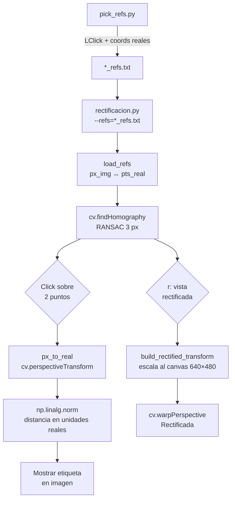

<figure markdown>
  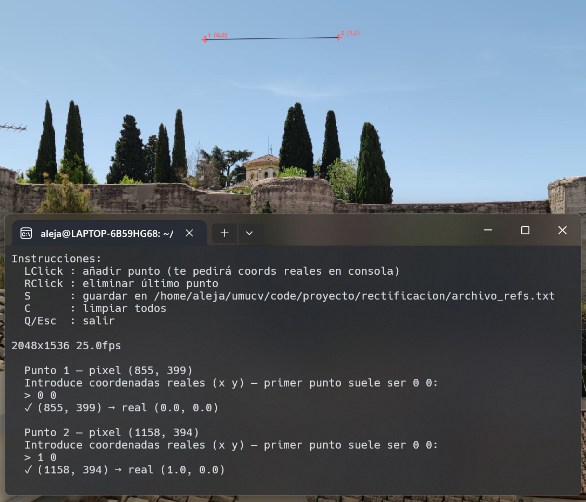
  <figcaption>Interfaz de <code>pick_refs.py</code>: cruces amarillas sobre los puntos de referencia marcados. En consola se introducen las coordenadas reales de cada punto.</figcaption>
</figure>

---

## Parámetros clave { #parametros }

### Homografía

| Parámetro | Valor | Descripción |
|-----------|-------|-------------|
| `--refs` | `refs.txt` | Ruta al fichero de referencias |
| `--units` | `mm` | Etiqueta de unidades que aparece en la medición |
| RANSAC threshold | 3.0 px | Tolerancia de error de reproyección en `findHomography` |
| Mínimo de referencias | 4 puntos | Necesario para que la homografía esté determinada |

### Vista rectificada

| Parámetro | Valor | Descripción |
|-----------|-------|-------------|
| Canvas de salida | 640 × 480 px | Tamano fijo de la ventana rectificada |
| Margen | 35 px | Espacio entre el borde del canvas y el contenido |
| Escala `s` | calculada | `min((W-2M)/span_x, (H-2M)/span_y)` px/unidad |

!!! tip "Calidad de la homografía"
    Al arrancar, el programa imprime `Homografía calculada: N/M inliers`. Si `N < M`, algún punto de referencia fue marcado con poca precisión y fue descartado por RANSAC. Con exactamente 4 puntos, RANSAC no tiene efecto pero tampoco dana.

---

## Casos de uso { #casos }

### Monedas sobre mesa (`coins.png`)

<figure markdown>
  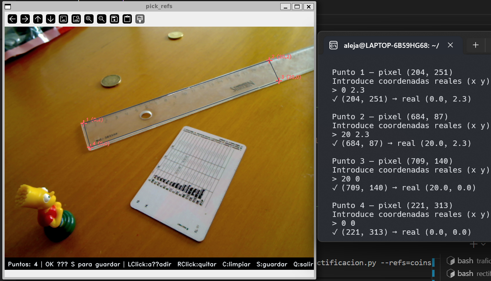
  <figcaption>Superficie plana con regla y moneda. Los 4 puntos de referencia (cruces) delimitan un rectángulo de 20 × 2.3 unidades sobre la mesa.</figcaption>
</figure>

<figure markdown>
  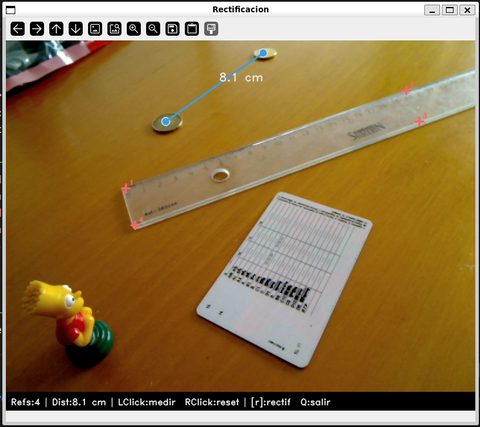
  <figcaption>Distancia medida entre dos puntos de la superficie usando la homografía calculada a partir de la regla.</figcaption>
</figure>

Referencia: segmento de regla visible en la imagen. Los 4 puntos definen un rectángulo de dimensiones conocidas sobre el plano de la mesa.

---

### Muralla zirí del Albaicín (`muralla.jpeg`)

<figure markdown>
  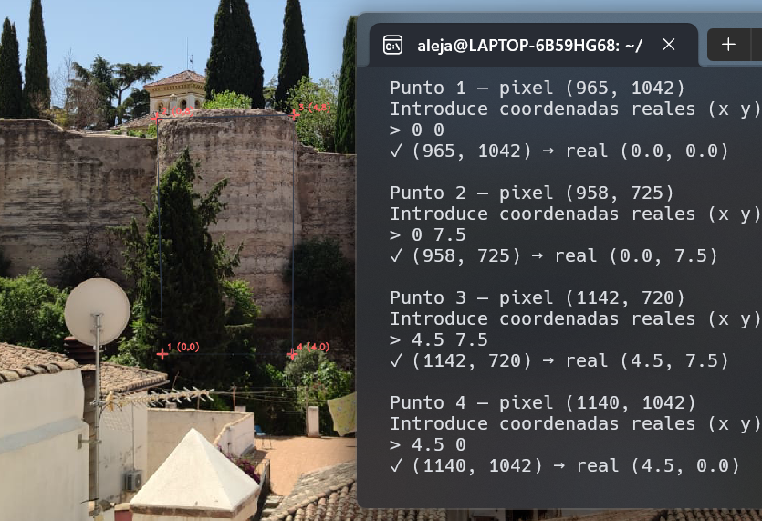
  <figcaption>Los 4 puntos de referencia marcan las esquinas de una torre (4.5 × 7.5 m) visible en el lienzo de muralla. A partir de ellos se puede medir cualquier otro tramo.</figcaption>
</figure>

<figure markdown>
  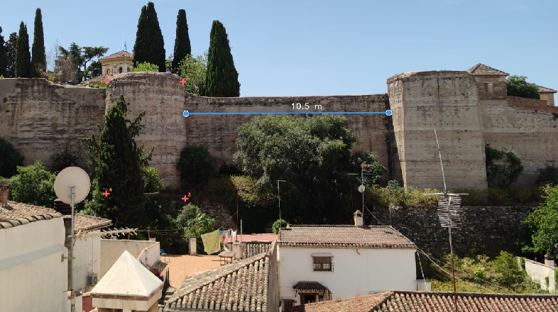
  <figcaption>Medición de un tramo de la muralla zirí que rodea el palacio de Dar al-Horra. La distancia se obtiene en metros.</figcaption>
</figure>

<figure markdown>
  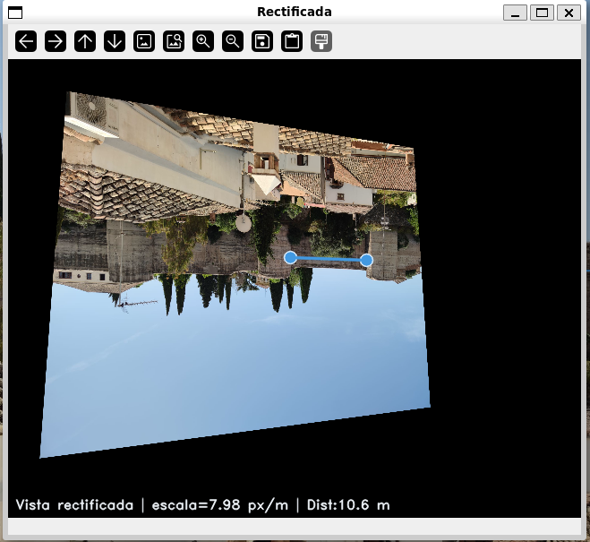
  <figcaption>Vista rectificada (<code>r</code>) del plano de la muralla: la perspectiva queda eliminada y el lienzo aparece frontal.</figcaption>
</figure>

Referencia: torre de la muralla con dimensiones estimadas de **4.5 × 7.5 m** (ancho × alto). El fichero `muralla_refs.txt` marca las cuatro esquinas de esa torre como sistema de coordenadas.

---

### Calle con cuesta del Albaicín (`cuesta.jpeg`)

<figure markdown>
  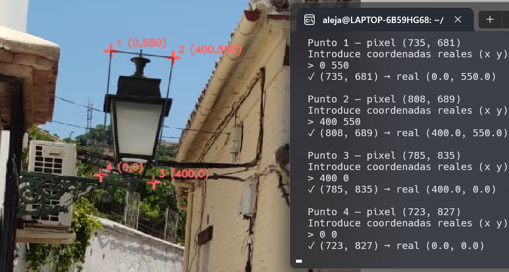
  <figcaption>Las cuatro esquinas del rectángulo circunscrito al farol antiguo de calle (400 × 550 mm) actúan como referencias para calibrar la homografía del plano vertical de la fachada.</figcaption>
</figure>

<figure markdown>
  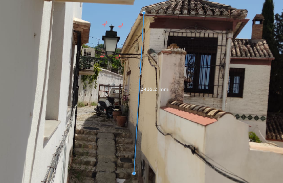
  <figcaption>Medición de elementos de la calle (escalones, anchura de paso) usando el farol como referencia. Unidades en mm.</figcaption>
</figure>

Referencia: rectángulo circunscrito al farol típico de calle espanola con dimensiones conocidas: **400 × 550 mm** (ancho × alto). El plano de referencia es el plano vertical de la fachada donde está anclado el farol.

---

### Gol de Éder — Euro 2016 (`gol-eder.png`)

<figure markdown>
  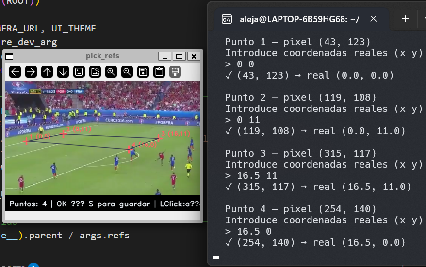
  <figcaption>Puntos de referencia sobre las líneas del terreno de juego (16.5 × 11 m). Las líneas del área y del punto de penalti son coplanares y de dimensiones reglamentarias.</figcaption>
</figure>

<figure markdown>
  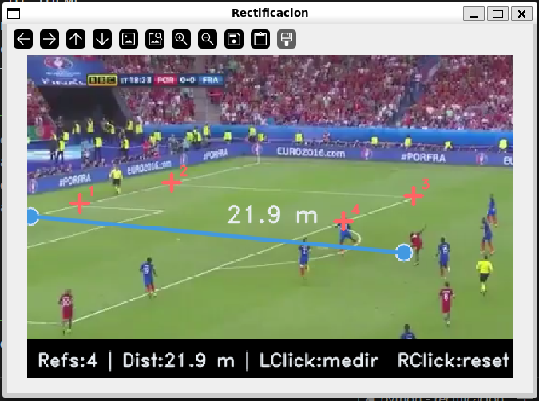
  <figcaption>Distancia entre jugadores en el momento de la jugada, medida en metros sobre el plano del césped.</figcaption>
</figure>

Referencia: rectángulo sobre el terreno de juego de **16.5 × 11 m** definido a partir de las líneas reglamentarias del área y el punto de penalti. Permite medir distancias entre jugadores directamente sobre la retransmisión.

---

## Código clave { #codigo }

### Carga de referencias y homografía

```python title="rectificacion/rectificacion.py — load_refs() + findHomography()" linenums="1"
def load_refs(path):
    img_pts, real_pts, labels = [], [], []
    with open(path) as f:
        for line in f:
            line = line.strip()
            if not line or line.startswith('#'):
                continue
            parts = line.split()
            img_pts.append([float(parts[0]), float(parts[1])])
            real_pts.append([float(parts[2]), float(parts[3])])
            labels.append(' '.join(parts[4:]) if len(parts) > 4 else '')
    return np.array(img_pts, np.float32), np.array(real_pts, np.float32), labels

# Homografía imagen → plano real con RANSAC
H, hmask = cv.findHomography(pts_img, pts_real, cv.RANSAC, 3.0)

def px_to_real(x, y):
    r = cv.perspectiveTransform(np.array([[[x, y]]], np.float32), H)
    return r[0, 0]
```

### Vista rectificada

```python title="rectificacion/rectificacion.py — build_rectified_transform()" linenums="1"
def build_rectified_transform(frame):
    h, w = frame.shape[:2]
    corners = np.array([[0,0],[w,0],[w,h],[0,h]], np.float32)
    corners_real = cv.perspectiveTransform(corners.reshape(1,-1,2), H)[0]
    mn = corners_real.min(axis=0)
    mx = corners_real.max(axis=0)
    span = mx - mn

    OUT_W, OUT_H, MARGIN = 640, 480, 35
    s = min((OUT_W - 2*MARGIN) / span[0], (OUT_H - 2*MARGIN) / span[1])

    M = np.array([[s, 0, MARGIN - mn[0]*s],
                  [0, s, MARGIN - mn[1]*s],
                  [0, 0, 1]], np.float64)
    H_disp = M @ H.astype(np.float64)
    return H_disp, s, mn, (OUT_W, OUT_H)
```

---

## Decisiones de diseno { #decisiones }

### Dos scripts independientes: `pick_refs` + `rectificacion`

Separar la creación del fichero de referencias del proceso de medición permite reutilizar el mismo `.txt` en múltiples sesiones sin repetir el marcado. Las referencias son persistentes y editables a mano.

### RANSAC en `findHomography`

Con exactamente 4 puntos, RANSAC no tiene efecto (no hay suficientes muestras para votar). Sin embargo, con 5 o más referencias tolera hasta un punto marcado con error apreciable sin degradar la homografía. El umbral de 3.0 px descarta outliers claros sin ser demasiado restrictivo.

### Vista rectificada calculada una sola vez

`build_rectified_transform` se llama al inicio sobre el primer frame. La homografía H_disp compone H con la transformación de escala/traslación al canvas, por lo que `warpPerspective` aplica todo en una sola pasada sin recomputar nada por cada pulsación de `r`.

### Plano único de referencia

Toda la medición asume que los puntos marcados y los puntos a medir son coplanares. Esta restricción es explícita por diseno: no hay corrección de distorsión de lente ni reconstrucción 3D.

---

## Limitaciones { #limitaciones }

!!! warning "Limitaciones conocidas"
    - Solo mide distancias en el **mismo plano** que los puntos de referencia: objetos fuera de ese plano dan mediciones incorrectas.
    - La precisión de la homografía depende directamente de con qué cuidado se hayan marcado los puntos en `pick_refs.py`; un error de unos pocos píxeles en una referencia puede propagarse a centímetros en la medición.
    - No corrige **distorsión radial** de la lente: en objetivos muy angulares, las líneas rectas aparecen curvadas y la homografía plana no es suficiente.
    - La vista rectificada puede presentar **zonas negras** (sin información) si la imagen original fue tomada con un ángulo muy oblicuo respecto al plano.
    - Con referencias de un **plano vertical** (como el farol de la cuesta), cualquier objeto que no esté anclado a ese plano (personas, vehículos) no puede medirse correctamente.
    - El fichero de referencias debe **rehacerse** cada vez que se use una imagen diferente o si la cámara se mueve entre la toma de referencia y la medición.
