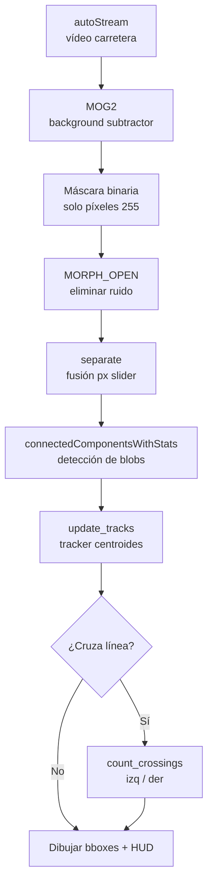
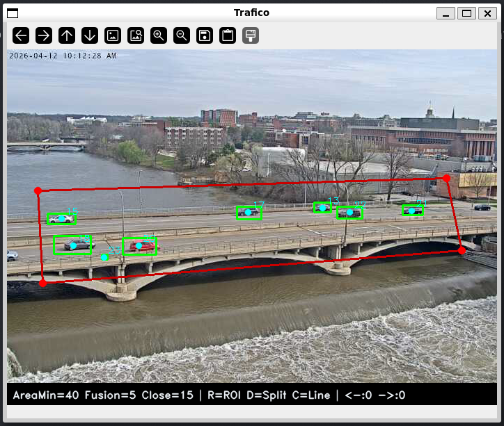
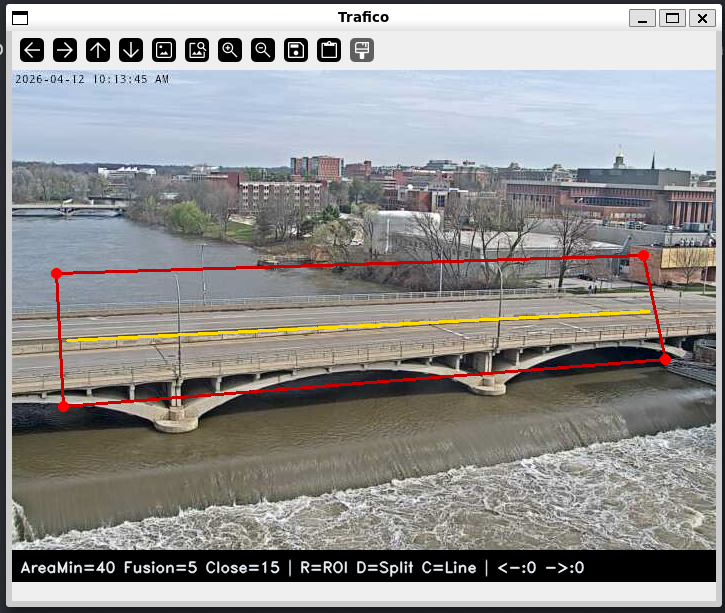
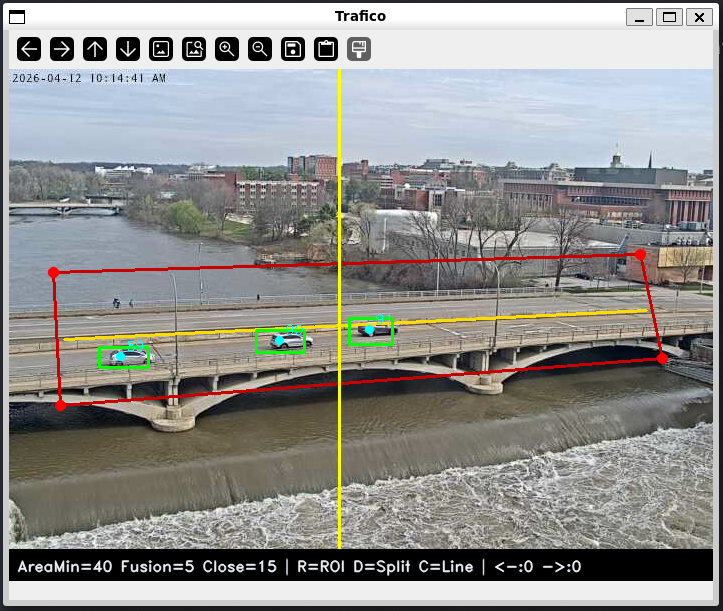
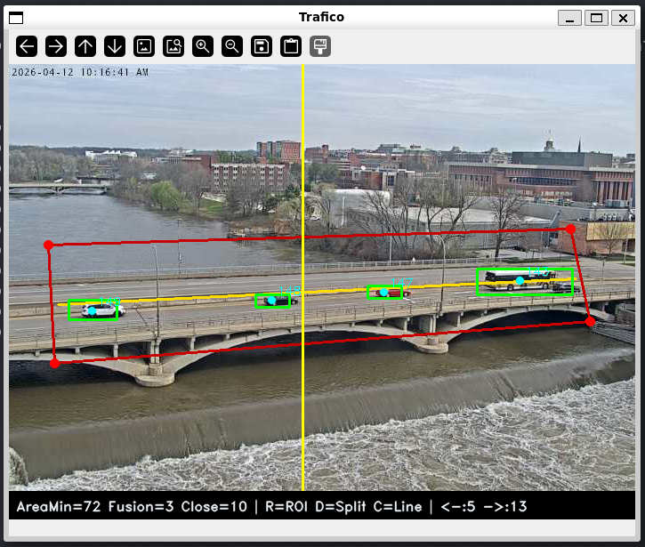
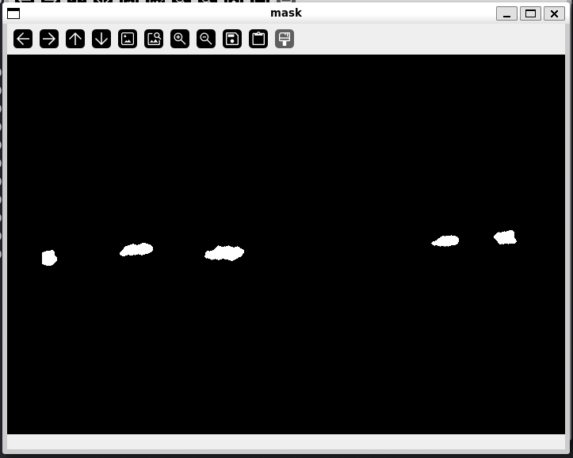
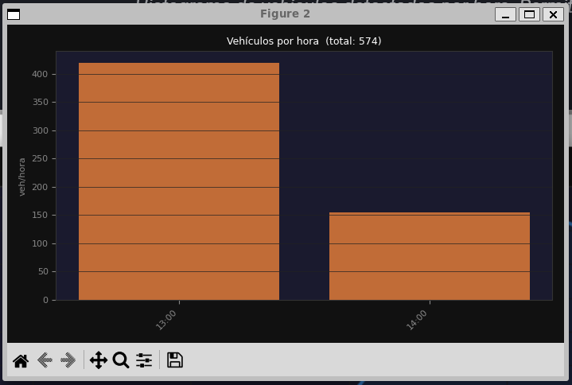
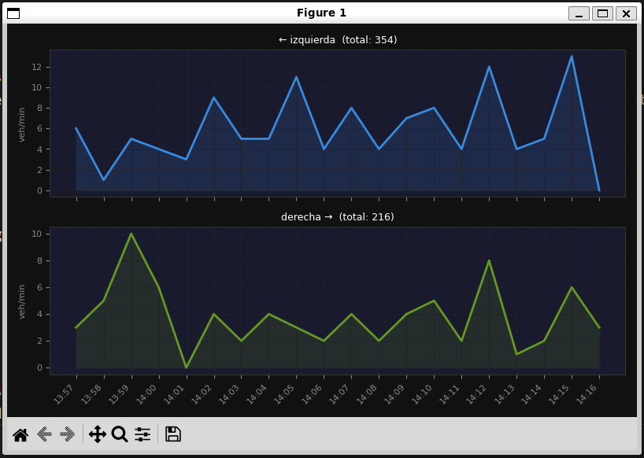

# Análisis de Tráfico

## Descripción

`trafico/trafico.py` analiza una secuencia de vídeo de carretera y **cuenta vehículos por sentido** que cruzan una línea virtual configurable. Usa sustracción de fondo MOG2, componentes conectados y un **tracker de centroides** propio, sin Machine Learning.

---

## Requisitos y ejecución { #requisitos }

!!! info "Entorno"
    Python 3.10+, OpenCV 4.9, NumPy 1.26.

```bash
python trafico/trafico.py
```

!!! tip "Configuración inicial (3 pasos con clics)"
    1. Pulsa `R` + **4 clics** → define el polígono ROI sobre la calzada.
    2. Pulsa `D` + **2 clics** → traza la línea divisoria entre sentidos.
    3. Pulsa `C` + **1 clic** → coloca la línea vertical de conteo.

---

## Arquitectura { #arquitectura }



### Configuración paso a paso

=== "Paso 1 — ROI"

    Pulsa `R` y haz **4 clics** para definir el polígono de análisis.

    <figure markdown>
      
      <figcaption>ROI poligonal de 4 vértices dibujada sobre la calzada.</figcaption>
    </figure>

=== "Paso 2 — Línea divisoria"

    Pulsa `D` y haz **2 clics** para trazar la línea que separa los dos sentidos.

    <figure markdown>
      
      <figcaption>Línea divisoria (cian) que separa el carril izquierdo del derecho.</figcaption>
    </figure>

=== "Paso 3 — Línea de conteo"

    Pulsa `C` y haz **1 clic** para colocar la línea vertical de cruce.

    <figure markdown>
      
      <figcaption>Línea de conteo vertical (amarillo). Los vehículos se cuentan cuando su centroide la cruza.</figcaption>
    </figure>

---

## Parámetros clave { #parametros }

| Parámetro | Valor | Descripción |
|-----------|-------|-------------|
| `MAX_DIST` | 50 px | Distancia máxima para asociar detección a track existente |
| `MAX_AGE` | 5 frames | Frames sin detección antes de eliminar un track |
| `ALPHA` | 0.4 | Factor de suavizado del centroide (EMA) |
| `learningRate` MOG2 | 0 en pausa | Se congela para evitar que el fondo absorba el frame pausado |

!!! tip "Parámetro más sensible: ALPHA"
    Con `ALPHA` alto el centroide es nervioso y puede cruzar la línea de conteo por un pico de ruido en la máscara. Con `ALPHA` bajo va rezagado respecto al vehículo real. **0.4** es el equilibrio donde ninguno de los dos problemas aparece en condiciones normales.

### Cadena morfológica

El orden de los tres pasos no es intercambiable:

| Paso | Operación | Propósito |
|------|-----------|-----------|
| 1 | `MORPH_OPEN` (5×5 fijo) | Elimina píxeles sueltos de ruido |
| 2 | `MORPH_CLOSE` (`Close px` slider) | Rellena huecos dentro del vehículo |
| 3 | `separate()` (`Fusion px` slider) | Separa blobs fusionados entre sí |

---

## Código clave { #codigo }

### Sistema en funcionamiento

<figure markdown>
  
  <figcaption>Sistema con todos los elementos configurados. El HUD inferior muestra los contadores en tiempo real: <code>&lt;--:N --&gt;:M</code>.</figcaption>
</figure>

<figure markdown>
  
  <figcaption>Máscara binaria del foreground dentro del ROI.</figcaption>
</figure>

### Tracker de centroides

```python title="trafico/trafico.py — update_tracks()" linenums="1"
MAX_DIST = 50   # px para asociar detección a track existente
MAX_AGE  = 5    # frames sin ver antes de eliminar el track

def update_tracks(objs):
    detections = [(o[0], o[1]) for o in objs.values()]
    matched_tracks = set()
    result = {}

    for cx, cy in detections:
        best_id, best_d = None, MAX_DIST + 1
        for tid, t in tracks.items():
            d = np.hypot(cx - t["cx"], cy - t["cy"])
            if d < best_d:
                best_d, best_id = d, tid

        if best_id is not None and best_id not in matched_tracks:
            result[best_id] = {"cx": cx, "cy": cy, "age": 0}
            matched_tracks.add(best_id)
        else:
            result[next_id[0]] = {"cx": cx, "cy": cy, "age": 0}
            next_id[0] += 1

    for tid, t in tracks.items():
        if tid not in matched_tracks and t["age"] + 1 < MAX_AGE:
            result[tid] = {**t, "age": t["age"] + 1}

    tracks.clear()
    tracks.update(result)
```

### Detección de cruce

```python title="trafico/trafico.py — count_crossings()" linenums="1"
def count_crossings():
    xline = state["line_x"]
    for tid, t in tracks.items():
        cx, cy = t["cx"], t["cy"]
        if tid not in prev_pos:
            continue
        px = prev_pos[tid]
        if (px < xline <= cx) or (px > xline >= cx):
            side = "izq" if cy < split_y(cx) else "der"
            state["count"][side] += 1
            state["history"].append((time.time(), side))
    prev_pos.clear()
    prev_pos.update({tid: t["cx"] for tid, t in tracks.items()})
```

### Gráficas de análisis

<figure markdown>
  
  <figcaption>Histograma de vehículos detectados por hora. Permite identificar horas punta.</figcaption>
</figure>
<figure markdown>
  
  <figcaption>Comparativa de flujo por sentido a lo largo del tiempo.</figcaption>
</figure>

---

## Decisiones de diseño { #decisiones }

### MOG2 frente a frame differencing

Frame differencing genera demasiado ruido en exteriores: cualquier cambio de iluminación —una nube, una sombra— produce falsas detecciones. MOG2 modela el fondo como una mezcla de gaussianas que se actualiza frame a frame, lo que le da tolerancia a esos cambios lentos. El pipeline completo corre en ~12 ms/frame en CPU.

El precio de MOG2 es que no distingue "fondo" de "objeto estático": un vehículo parado empieza a incorporarse al modelo y desaparece de la máscara. Por eso `learningRate` se fija a 0 cuando el vídeo está pausado.

| Enfoque | Velocidad | Robustez iluminación | Objetos estáticos |
|---------|-----------|---------------------|-------------------|
| Frame differencing | Muy rápido | Baja | Sin problema |
| MOG2 | ~12 ms/frame | Alta | Los absorbe si están quietos |

### Orden de la cadena morfológica

`MORPH_OPEN` va primero para eliminar ruido antes de que los pasos siguientes lo amplíen. `MORPH_CLOSE` actúa después porque MOG2 suele dejar huecos en zonas de textura homogénea (el capó liso de un coche) y un vehículo con agujeros puede fragmentarse en varios blobs y contarse dos veces. `separate()` va al final, cuando los blobs ya son coherentes, para romper los puentes finos entre vehículos que circulan pegados.

### Tracker sin Kalman

Con 5–10 vehículos en el ROI, la asignación por distancia euclidiana mínima es suficiente. El algoritmo húngaro daría una asignación globalmente óptima cuando dos tracks se cruzan, pero eso es raro en tráfico normal y añadiría complejidad sin beneficio claro. `MAX_AGE=5` cubre los casos de oclusión manteniendo el track vivo durante 5 frames sin detección.

### Doble conteo en la línea

Un vehículo parado sobre la línea puede disparar conteos repetidos porque el centroide oscila ±1–2 px entre frames por variaciones de la máscara. En carretera fluida casi nunca ocurre, pero en retenciones podría ser un problema. La solución sería añadir un cooldown por `tid`: ignorar nuevos cruces del mismo vehículo durante N frames tras el primero.

### Línea divisoria y perspectiva

`split_y(cx)` interpola linealmente entre los dos puntos que define el usuario, lo que permite trazar una divisoria oblicua adaptada a la perspectiva. En curvas pronunciadas o con la cámara muy inclinada la separación real deja de ser lineal y la asignación izq/der puede fallar. La solución correcta sería una homografía a vista cenital previa al procesamiento.

---

## Limitaciones { #limitaciones }

!!! warning "Limitaciones conocidas"
    - Solapamiento de vehículos → se fusionan en un blob y se cuentan como uno.
    - El tracker simple puede perder la asociación con vehículos muy rápidos o que se paran.
    - La línea de cruce es vertical; en carreteras muy oblicuas el conteo es menos preciso.
    - Un vehículo parado mucho tiempo puede ser absorbido por el modelo de fondo (MOG2).
    - Baja luz o lluvia genera ruido que supera el umbral de área mínima.